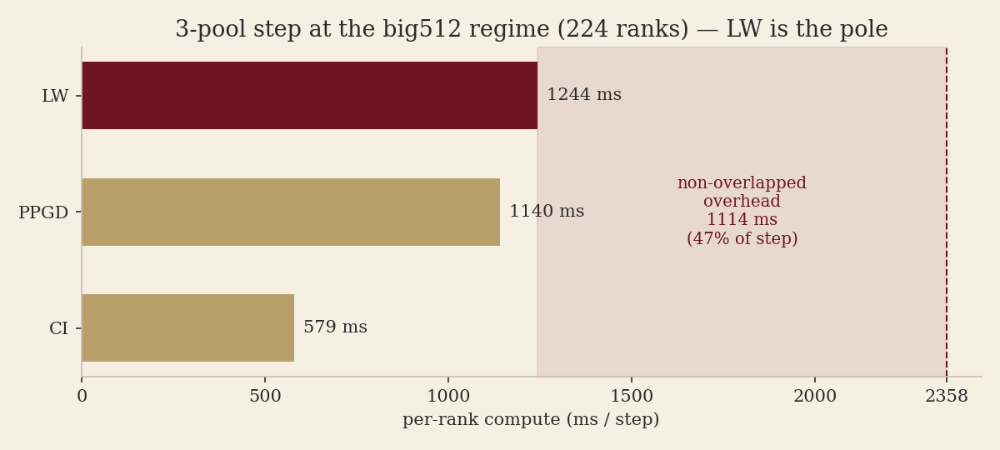

# 3-pool topology calibration — big512 regime (2026-06-03)

Config-specific calibration of the generic `scripts/topology_search.py` throughput screen.
The tool takes calibration as **input**; this doc records the big512 numbers. **Every claim
below is reproduced by running the repro script** — the calibration inputs it consumes are
listed (and verifiable) under [Provenance](#provenance).

```bash
python scripts/repro_big512_topology_search.py            # the search (prints provenance)
python scripts/repro_big512_topology_search.py --plots docs/img/3pool_topology_calibration_2026-06-03/
```

## The step at the big512 regime



Pools run lockstep → `step ≈ max(pool compute) + overhead`. From the repro:

- per-rank compute: **LW 1244 ms (the pole)** ≳ PPGD 1140 ≳ CI 579.
- **overhead 1114 ms ≈ 47%** of the 2358 ms step.
- derived: `k_ci=36.2`, `k_ppgd=142.5`, `k_lw_total=311` (ms).
- **big512 (ci32/ppgd64/lw128) is the screen's best topology for B=512 / 224 ranks** — every
  top config ties at 0.2171 samples/ms.

## Caveat: LW is sublinear in batch


The repro's figure: LW per-(site·sample) compute is **39.5 ms at bl_lw=4 vs 3.2 ms at
bl_lw=64 — ~12×**. That large fixed per-site cost means the model's *linear* LW term
over-credits adding LW ranks. The model is also **LW-shape-blind** (`compute_lw` depends only
on `n_lw` — the repro shows every LW shape at fixed `n_lw` ties) and its **overhead is
scale-dependent**. A screen, not a verdict — validate winners with a real run.

## Provenance

The repro prints this block; the model above is *derived* from these inputs (verify them):

- **per-pool compute** ← `python scripts/analyze_3pool_trace.py <rebalance-6site trace>`
  (job 38431, 112 ranks LW64/CI16/PPGD32, B=256). Its per-rank batch_local (lw 64 / ci 16 /
  ppgd 8, 6 sites/block) is identical to big512, so the per-rank compute carries over exactly.
- **step wall 2358 ms** ← big512 production `p-b6505e9c`, logged `train/perf/step_ms` at
  224 ranks (used instead of the trace's own 112-rank wall ~2138 ms so `overhead` is
  production-scale).
- **LW old point 632 ms @ (4 sites/block, bl=4)** ← job 34379 (pre-compile); used only for
  the sublinearity figure's left bar.

## Re-calibrate

1. Run a short profiling smoke (`torch_profile` on) at a representative topology, or reuse a
   trace under `$DATA/torch_profile/<job>/`.
2. `python scripts/analyze_3pool_trace.py <trace_dir>` → per-pool `compute` means + each
   pool's batch_local.
3. Step **wall** from the production run's logged `train/perf/step_ms` at the search scale.
4. Update the numbers in `scripts/repro_big512_topology_search.py` and re-run.
