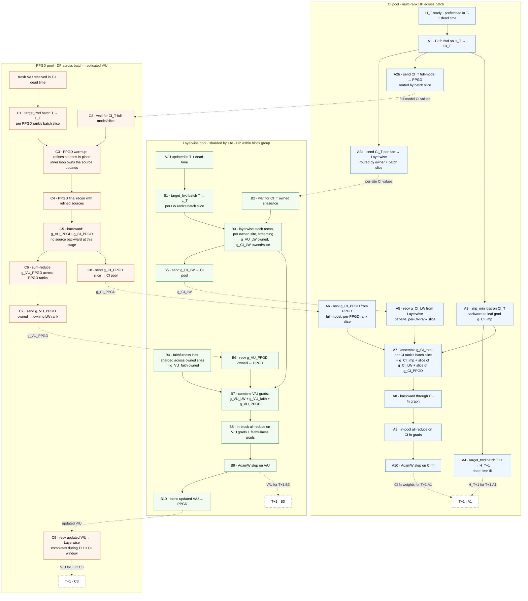
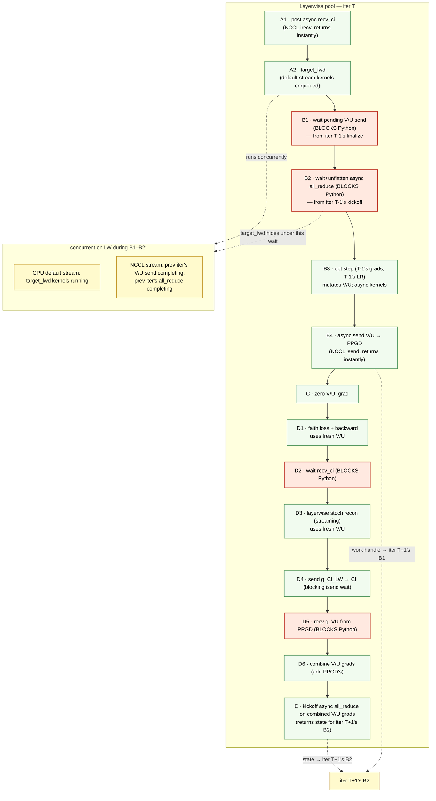
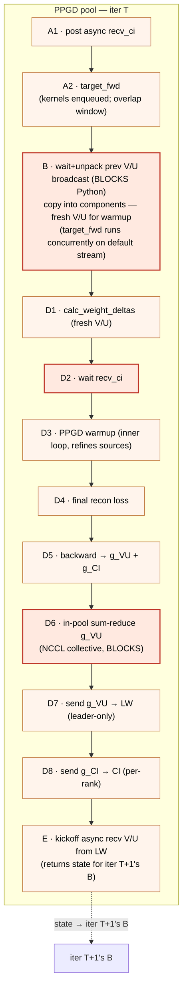
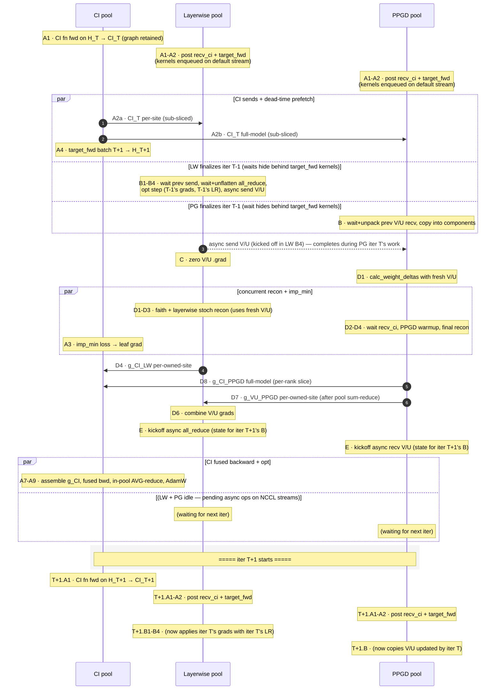

# Three-pool training — design sketch

Extension of the 2-pool subsystem (`param_decomp/two_pool/`). Splits the CI
function into its own pool so a **global shared transformer** CI fn becomes
physically realizable again (under 2-pool, sites are sharded across pool-A
ranks, which structurally rules out a CI fn that spans all sites).

## Pool roles

| Pool       | Owns                            | Sharded? | Notes |
|------------|---------------------------------|----------|-------|
| **CI**     | CI fn + CI-fn optimizer state   | DP across batch (replicated CI fn) | Computes canonical CI values + importance-minimality. Multi-rank DP, same pattern as today's PPGD pool. |
| **Layerwise** | V/U + V/U optimizer state    | by site (block groups) + DP across batch within a group | Layerwise stoch recon + faithfulness. Same shape as today's Pool A minus the CI fn. |
| **PPGD**   | full V/U replica + PPGD sources | DP across batch (replicated V/U)   | Full-model PPGD. Same as today's Pool B. Inner-loop warmup owns source updates; final recon backward only seeds V/U + CI grads. |

## Per-step dependency graph (steady state, step T)

Each pool's column reads top-to-bottom in time. Solid arrows are within-step
deps; dashed arrows are cross-step.



## Synchronized timeline (one step T, all three pools share a vertical axis)

`sequenceDiagram` gives every actor the same vertical time axis, so you can
read across rows to see what each pool is doing at the same moment. Cross-pool
arrows are the actual sends. `Note over` annotations cover work that happens
inside a pool without messaging.

```mermaid
sequenceDiagram
    autonumber
    participant CI as CI pool
    participant LW as Layerwise pool
    participant PG as PPGD pool

    Note over CI: A1 · CI fn fwd on H_T → CI_T
    Note over LW: B1 · target_fwd batch T → L_T (LW rank's slice)
    Note over PG: C1 · target_fwd batch T → L_T (PPGD rank's slice)

    CI->>LW: A2a · CI_T per-site, owned + LW-rank slice
    CI->>PG: A2b · CI_T full-model, PPGD-rank slice

    par CI does imp_min + dead-time prefetch
        Note over CI: A3 · imp_min loss → g_CI_imp (leaf grad)
        Note over CI: A4 · target_fwd batch T+1 → H_T+1 (prefetch)
    and Layerwise recon
        Note over LW: B3 · layerwise stoch recon (per owned site, streaming)<br/>→ g_VU_LW owned, g_CI_LW owned/slice
        Note over LW: B4 · faithfulness (sharded over owned sites)<br/>→ g_VU_faith owned
    and PPGD recon
        Note over PG: C3 · PPGD warmup (inner loop owns source updates)
        Note over PG: C4-C5 · final recon + bwd<br/>→ g_VU_PPGD full, g_CI_PPGD full
        Note over PG: C6 · sum-reduce g_VU_PPGD within PPGD pool
    end

    LW->>CI: B5 · g_CI_LW (per-site, per-LW-rank slice)
    PG->>CI: C8 · g_CI_PPGD (full-model, per-PPGD-rank slice)
    PG->>LW: C7 · g_VU_PPGD (per-owned-site, to owning LW rank)

    Note over CI: A7 · assemble g_CI_total per CI rank's slice
    Note over CI: A8 · backward through CI-fn graph
    Note over CI: A9 · in-pool all-reduce on CI fn grads
    Note over CI: A10 · AdamW step on CI fn

    Note over LW: B7 · combine V/U grads (LW + faith + PPGD)
    Note over LW: B8 · in-block all-reduce on V/U grads

    rect rgb(245, 245, 245)
        Note over CI,PG: ===== step boundary =====<br/>CI starts T+1.A1 (CI fn fwd) immediately;<br/>LW + PPGD use this window to hide V/U opt + V/U ship-back
    end

    Note over CI: T+1.A1 · CI fn fwd on H_T+1 → CI_T+1
    Note over LW: B9 · AdamW step on V/U (hidden behind T+1.A1)
    LW-->>PG: B10/C9 · isend updated V/U → PPGD (hidden behind T+1.A1)

    CI->>LW: T+1.A2a · CI_T+1 per-site
    CI->>PG: T+1.A2b · CI_T+1 full-model
```

The `par` block is where the visible sync shines: all three pools fire in
parallel and you can see at-a-glance that the recon pools' heavy lifting
(B3-B4, C3-C5) happens concurrently with CI's dead-time prefetch (A3-A4).
The `rect` is the step boundary, with the deferred V/U opt + ship-back drawn
as happening *during* T+1's CI-fn-fwd window.

## Cross-step pipeline (the overlap that hides the V/U opt step)

```mermaid
gantt
    title Three-pool overlap (each row is one rank in that pool)
    dateFormat  X
    axisFormat  %s
    section CI pool
    T.A1 CI fn fwd            :ci1, 0, 2
    T.A2 send CI_T            :ci2, after ci1, 1
    T.A3 imp_min + leaf grad  :ci3, after ci2, 1
    T.A4 prefetch target_fwd T+1 :ci4, after ci3, 4
    T.A7 assemble + bwd CI    :ci7, after ci4, 2
    T.A9 all-reduce + opt step :ci9, after ci7, 1
    T+1.A1 CI fn fwd          :ci_n, after ci9, 2

    section Layerwise pool
    T.B1 target_fwd T         :lw1, 0, 2
    T.B3 layerwise stoch recon :lw3, after lw1, 4
    T.B4 faithfulness         :lw4, after lw3, 1
    T.B6/B7 recv g_VU_PPGD + combine :lw6, after lw4, 1
    T.B8/B9 all-reduce + opt step (hides behind T+1.A1) :lw9, after lw6, 2
    T.B10 ship V/U → PPGD     :lw10, after lw9, 1
    T+1.B1 target_fwd T+1     :lw_n, after lw10, 2

    section PPGD pool
    T.C1 target_fwd T         :pg1, 0, 2
    T.C3 PPGD warmup          :pg3, after pg1, 4
    T.C4/C5 final recon + bwd :pg5, after pg3, 1
    T.C6-C8 sum-reduce + sends :pg7, after pg5, 1
    T.C9 recv updated V/U (hides behind T+1.A1) :pg9, after pg7, 2
    T+1.C1 target_fwd T+1     :pg_n, after pg9, 2
```



## Strict cross-step edges

Only four edges actually force a wait between steps:

| Edge | Hidden behind |
|---|---|
| `T+1.A1` (CI fn fwd) needs `T.A10` (CI fn AdamW) | — (CI fn fwd kicks off T+1) |
| `T+1.A1` (CI fn fwd) needs `T.A4` (`H_{T+1}` prefetch) | T's recon window |
| `T+1.B3` (Layerwise stoch recon) needs `T.B9` (V/U AdamW) | T+1.A1 (CI fn fwd) |
| `T+1.C3` (PPGD warmup) needs `T.B10` (V/U ship) → `T.C9` recv | T+1.A1 (CI fn fwd) |

Everything else fits inside step T.

## Routing complexity vs 2-pool

The new wrinkle is **3-way batch slicing**. Today both pools either replicate
CI (pool A) or receive a full-model copy (pool B). Under 3-pool:

- CI rank `i` produces CI values for batch slice `S_ci[i]` and all sites.
- Layerwise rank `j` needs CI values for its owned sites `O[j]` and batch slice `S_lw[j]`.
- PPGD rank `k` needs CI values for all sites and batch slice `S_pgd[k]`.

In general `S_ci[i]`, `S_lw[j]`, `S_pgd[k]` don't align — so the CI→LW and
CI→PPGD sends become **many-to-many along the batch dim**. Symmetric for grads
coming back. A reasonable simplification for the MVP is to constrain the
batch splits so each LW slice and each PPGD slice fits inside exactly one CI
slice (i.e. choose `N_ci` to divide both `N_lw` and `N_pgd`, or vice versa),
which reduces it to one-to-many fan-out + many-to-one reduction.

## Open design questions to resolve before coding

1. **Batch-split divisibility.** Pick an N_ci / N_lw / N_pgd compatibility
   rule. Easiest: `N_ci` divides `N_pgd` and `N_lw_per_block`. Validator should
   reject anything else loudly.
2. **CI value wire dtype.** Today CI is shipped bf16 and upcast to fp32 on the
   Layerwise side. Same pattern likely works for both downstream pools.
3. **Where do imp_min grads enter the CI-fn backward?** Cleanest is: imp_min
   is computed inside the CI-fn forward graph and contributes directly to the
   single CI-fn backward, with `g_CI_LW + g_CI_PPGD` injected as a `grad_tensors=`
   seed on the same backward call (same shape as today's pool-A combined backward).
4. **Validator extensions.** Mirror today's `_validate_pd_config_for_two_pool`:
   require `ImportanceMinimalityLoss` lives on CI pool; allow `mode: layerwise`
   *or* `mode: global` (with `fn_type: global_shared_transformer`) since CI
   ownership is no longer sharded.
5. **Checkpointing.** Still no distributed-aware checkpoint, so `save_every`
   stays None for the MVP.

---

# Async pipelining (`defer_vu_opt=True`)

The MVP runs the LW V/U opt step at end of step T (sync mode). When
`ThreePoolConfig.defer_vu_opt=True`, the LW pool's in-block all_reduce on V/U
+ faith grads is kicked off as **`async_op=True`** at end of step T and waited
at the top of step T+1 — overlapped with target_fwd on the default CUDA
stream. PPGD pool's V/U recv from LW is symmetrically deferred (otherwise
LW's deferred send would deadlock against PPGD's blocking sync recv).

## Why the async pattern is the actual win

`optimizer.step()` enqueues AdamW kernels onto the default CUDA stream and
returns to Python immediately — it's not on Python's critical path. The
**blocking** op in the tail is the in-block all_reduce (NCCL collective).
By switching it to `async_op=True` and doing useful compute between
kickoff and wait, we hide most of the all_reduce latency.

`target_fwd` is the natural overlap candidate: it runs the frozen
target_model (no V/U dependency, no CI dependency), so it can execute on the
default CUDA stream while the all_reduce runs on the NCCL stream.

**Caveat**: the win is only observable when `N_per_block_lw > 1`. With
`N_per_block_lw == 1` (the example YAML), the in-block all_reduce is a
no-op — the toggle has no observable wall-clock effect.

## Per-iter execution order in async mode





## Synchronized timeline — async mode, all three pools

Shared vertical time axis. `par` blocks are the genuine concurrency windows.



## Where Python actually blocks vs runs async

Helpful summary for reading the diagrams: what kind of call is each phase?

| Pool | Phase | Op | Blocks Python? |
|---|---|---|---|
| LW  | A1  | `dist.irecv(..., async_op=True)` — `async_recv_ci_from_ci_pool` | No (returns Work handles) |
| LW  | A2  | `component_model(batch)` then `.detach()` | No (kernels enqueued, return) |
| LW  | B1  | `Work.wait()` on pending V/U send | **Yes** |
| LW  | B2  | `Work.wait()` on async all_reduce | **Yes** |
| LW  | B3  | `optimizer.step()` | No (kernels enqueued) |
| LW  | B4  | `dist.isend` then return | No |
| LW  | C   | `param.grad = None` | No (Python only) |
| LW  | D1  | `(c*loss).backward()` | No (kernels enqueued) |
| LW  | D2  | `Work.wait()` on recv_ci | **Yes** |
| LW  | D3  | streaming `.backward()` × N sites | No (kernels) |
| LW  | D4  | `dist.isend` + `Work.wait()` (sync semantic) | **Yes** |
| LW  | D5  | `dist.recv` + `dist.broadcast` (sync) | **Yes** |
| LW  | D6  | `.add_()` on grads | No (kernels) |
| LW  | E   | `dist.all_reduce(async_op=True)` | No (returns Work) |
| CI  | A1  | `calc_causal_importances` | No (kernels) |
| CI  | A2  | `dist.isend` × N | No |
| CI  | A3  | imp_min compute + `dist_fn.all_reduce` (autograd-aware) | **Yes** (the autograd all_reduce blocks) |
| CI  | A4  | target_fwd of batch T+1 | No (kernels) |
| CI  | A5-6| `recv_g_ci_from_layerwise` + `recv_g_ci_from_ppgd` | **Yes** (sync wait on each `dist.irecv` Work) |
| CI  | A7  | tensor `.add` for assembly | No (kernels) |
| CI  | A8  | `torch.autograd.backward` | No (kernels) |
| CI  | A9  | sync `dist.all_reduce` (in-pool AVG) | **Yes** |
| CI  | A10 | `optimizer.step()` | No (kernels) |
| PG  | A1  | async `dist.irecv` × N | No |
| PG  | A2  | target_fwd | No (kernels) |
| PG  | B   | `Work.wait()` on prev V/U broadcast | **Yes** |
| PG  | D2  | `Work.wait()` on recv_ci | **Yes** |
| PG  | D3-D5 | PPGD warmup loop + backward | Mostly kernels; `.item()` calls inside warmup may force CPU sync |
| PG  | D6  | sync `dist.all_reduce` (in-pool SUM) | **Yes** |
| PG  | D7-D8 | `dist.isend` × N + waits | **Yes** (waits at end) |
| PG  | E   | async `dist.broadcast` kickoff | No (returns Work) |

Critical-path blocking points (red boxes in flowchart) are where additional
overlap could win wall-clock. Everything else is already happening
concurrently with whatever other compute/NCCL work has been kicked off.

# Remaining lack-of-dependency to exploit

A scan of the above for places where Python blocks on something that could
have been kicked off earlier (or where two blocking ops could be merged).
Listed roughly by leverage.

### 1. **LW: post async recv_g_vu early, wait at combine**

`recv_g_vu_from_ppgd` is currently sync at D5. It only blocks because we
haven't posted the irecv. The data dep (`combine` at D6) only needs the
grads at D6 — so we can post the irecv right after the target_fwd kicks off
(A2), letting the recv overlap with everything in B + C + D1-D4. Wait at D5.

Implementation cost: add async variant in layout.py
(`async_recv_g_vu_from_ppgd_kickoff` + `wait_and_unpack_g_vu`), thread the
state through D5 in step_layerwise. Modest (~50 LOC).

Expected win: hides recv latency (probably significant if PPGD is the slow
pool — its g_VU send happens after PPGD's full warmup + recon + sum-reduce,
which is the bulk of PPGD's step). Could shave ~30-100 ms per step.

### 2. **CI: post async recvs of g_CI from BOTH downstream pools concurrently**

Currently `recv_g_ci_from_layerwise` and `recv_g_ci_from_ppgd` are two
separate sync calls (each itself pipelined internally). Could refactor to
post both pools' irecvs in one call, then wait on all together. The
imp_min + prefetch H_T+1 work happens between A2 and A5 — moving the recv
posts to right after A2 (the sends) lets them race with imp_min compute on
the GPU.

Implementation cost: similar to (1), ~30 LOC.

Expected win: hides the recv setup latency. The actual blocking time of
recv is dominated by waiting for LW/PPGD to send their grads; this
refactor doesn't change that, just removes the per-call NCCL setup overhead.
Small but real (~5-10 ms).

### 3. **CI: async in-pool all_reduce on CI fn grads (mirror the LW pattern)**

CI's in-pool all_reduce (A9) is currently sync. Same trick as LW: kick off
async at end of iter T, wait at start of iter T+1 — overlapped with CI's
next iter's target_fwd / CI fn fwd kernels.

Implementation cost: pattern-match what we just did for LW. ~80 LOC.

Expected win: hides the CI in-pool all_reduce latency. For `N_ci > 1`
(currently `N_ci=1` in the example, so no-op). When multi-rank CI is used,
this is a real win — maybe ~10-30 ms / step.

### 4. **PPGD: async send_g_vu + send_g_ci can be kicked off in parallel**

Today (D7, D8) are sequential `dist.isend + wait` blocks. Combining them so
both pools' sends share one wait at end of phase D removes a serialization.

Implementation cost: ~20 LOC.

Expected win: small (~5 ms) — both sends are short.

### 5. **LW: send_g_ci + recv_g_vu overlap**

D4 (send g_CI to CI) and D5 (recv g_VU from PPGD) currently sequential.
They're independent ops — could post both async then wait on both.

Implementation cost: ~20 LOC.

Expected win: small (~5-10 ms), as both are short NCCL ops.

### 6. **Subsumed: LW + PPGD V/U opt deferred**

Already implemented as `defer_vu_opt`. This is the canonical example of the
"hide blocking NCCL behind useful compute on a different stream" pattern.

---

The pattern that emerges: **most Python-blocking points in the per-step flow
are NCCL ops, and most can be converted to `async_op=True` kickoff + later
wait with a fixed structural change (split layout method into kickoff +
wait_and_unpack).** The only blocking points that can't be elided this way
are the ones where the data dep is genuinely "I need this immediately to
proceed" — and the obvious example is the `Work.wait()` on recv_ci right
before zero_grad + faith_bwd on LW (we need fresh V/U... wait no, faith
doesn't need CI; only layerwise needs CI). Actually that wait could be
deferred further too — faith bwd could happen before wait_ci, and only
layerwise streaming needs CI. Push wait_ci into D3 (right before layerwise).
Small additional overlap.

Next session, if profile data backs up these projections, the biggest wins
look like:

- **(1) async recv_g_vu** — moderate effort, likely significant savings
- **(3) async CI in-pool all_reduce** — only if multi-rank CI

Defer the rest until profile data shows them on the critical path.
