# Three-pool training — design sketch

Extension of the 2-pool subsystem (`param_decomp/two_pool/`). Splits the CI
function into its own pool so a **global shared transformer** CI fn becomes
physically realizable again (under 2-pool, sites are sharded across pool-A
ranks, which structurally rules out a CI fn that spans all sites).

## Pool roles

| Pool       | Owns                            | Sharded? | Notes |
|------------|---------------------------------|----------|-------|
| **CI**     | CI fn + CI-fn optimizer state   | DP across batch (replicated CI fn) | Computes canonical CI values + importance-minimality. Multi-rank DP, same pattern as today's PPGD pool. |
| **Layerwise** | V/U + V/U optimizer state    | by site (block groups) + DP across batch within a group | Layerwise stoch recon + faithfulness. Same shape as today's Pool A minus the CI fn. |
| **PPGD**   | full V/U replica + PPGD sources | DP across batch (replicated V/U)   | Full-model PPGD. Same as today's Pool B. Inner-loop warmup owns source updates; final recon backward only seeds V/U + CI grads. |

## Per-step dependency graph (steady state, step T)

Each pool's column reads top-to-bottom in time. Solid arrows are within-step
deps; dashed arrows are cross-step.

```mermaid
flowchart TD
    classDef ci   fill:#eef6ff,stroke:#3b6db5,color:#000
    classDef lw   fill:#f1fbef,stroke:#3e8a4e,color:#000
    classDef pgd  fill:#fff4ec,stroke:#b9692a,color:#000
    classDef cross fill:#fff,stroke:#999,color:#000,stroke-dasharray:3 3

    subgraph CI[CI pool · multi-rank DP across batch]
        direction TB
        A0[H_T ready · prefetched in T-1 dead time]:::ci
        A1[A1 · CI fn fwd on H_T → CI_T]:::ci
        A2_LW[A2a · send CI_T per-site → Layerwise<br/>routed by owner + batch slice]:::ci
        A2_PG[A2b · send CI_T full-model → PPGD<br/>routed by batch slice]:::ci
        A3[A3 · imp_min loss on CI_T<br/>backward to leaf grad g_CI_imp]:::ci
        A4[A4 · target_fwd batch T+1 → H_{T+1}<br/>dead-time fill]:::ci
        A5[A5 · recv g_CI_LW from Layerwise<br/>per-site, per-LW-rank slice]:::ci
        A6[A6 · recv g_CI_PPGD from PPGD<br/>full-model, per-PPGD-rank slice]:::ci
        A7[A7 · assemble g_CI_total per CI rank's batch slice<br/>= g_CI_imp + slice of g_CI_LW + slice of g_CI_PPGD]:::ci
        A8[A8 · backward through CI-fn graph]:::ci
        A9[A9 · in-pool all-reduce on CI fn grads]:::ci
        A10[A10 · AdamW step on CI fn]:::ci

        A0 --> A1 --> A2_LW
        A1 --> A2_PG
        A1 --> A3 --> A4
        A4 -.->|H_{T+1} for T+1.A1| A11_next[T+1 · A1]:::cross
        A5 --> A7
        A6 --> A7
        A3 --> A7
        A7 --> A8 --> A9 --> A10
        A10 -.->|CI fn weights for T+1.A1| A11_next
    end

    subgraph LW[Layerwise pool · sharded by site · DP within block group]
        direction TB
        B0[V/U updated in T-1 dead time]:::lw
        B1[B1 · target_fwd batch T → L_T<br/>per LW rank's batch slice]:::lw
        B2[B2 · wait for CI_T owned sites/slice]:::lw
        B3[B3 · layerwise stoch recon, per owned site, streaming<br/>→ g_VU_LW owned, g_CI_LW owned/slice]:::lw
        B4[B4 · faithfulness loss sharded across owned sites<br/>→ g_VU_faith owned]:::lw
        B5[B5 · send g_CI_LW → CI pool]:::lw
        B6[B6 · recv g_VU_PPGD owned ← PPGD]:::lw
        B7[B7 · combine V/U grads: g_VU_LW + g_VU_faith + g_VU_PPGD]:::lw
        B8[B8 · in-block all-reduce on V/U grads + faithfulness grads]:::lw
        B9[B9 · AdamW step on V/U]:::lw
        B10[B10 · isend updated V/U → PPGD]:::lw

        B0 --> B1
        B1 --> B3
        B2 --> B3
        B3 --> B5
        B3 --> B7
        B4 --> B7
        B6 --> B7
        B7 --> B8 --> B9 --> B10
        B9 -.->|V/U for T+1.B3| B11_next[T+1 · B3]:::cross
    end

    subgraph PG[PPGD pool · DP across batch · replicated V/U]
        direction TB
        C0[fresh V/U received in T-1 dead time]:::pgd
        C1[C1 · target_fwd batch T → L_T<br/>per PPGD rank's batch slice]:::pgd
        C2[C2 · wait for CI_T full-model/slice]:::pgd
        C3[C3 · PPGD warmup: refines sources in-place<br/>inner loop owns the source updates]:::pgd
        C4[C4 · PPGD final recon with refined sources]:::pgd
        C5[C5 · backward: g_VU_PPGD, g_CI_PPGD<br/>no source backward at this stage]:::pgd
        C6[C6 · sum-reduce g_VU_PPGD across PPGD ranks]:::pgd
        C7[C7 · send g_VU_PPGD owned → owning LW rank]:::pgd
        C8[C8 · send g_CI_PPGD slice → CI pool]:::pgd
        C9[C9 · recv updated V/U ← Layerwise<br/>completes during T+1's CI window]:::pgd

        C0 --> C1
        C1 --> C3
        C2 --> C3
        C3 --> C4 --> C5
        C5 --> C6 --> C7
        C5 --> C8
        C9 -.->|V/U for T+1.C3| C11_next[T+1 · C3]:::cross
    end

    %% Cross-pool edges within step T
    A2_LW -.->|per-site CI values| B2
    A2_PG -.->|full-model CI values| C2
    B5  -.->|g_CI_LW| A5
    C8  -.->|g_CI_PPGD| A6
    C7  -.->|g_VU_PPGD| B6
    B10 -.->|updated V/U| C9
```

## Cross-step pipeline (the overlap that hides the V/U opt step)

```mermaid
gantt
    title Three-pool overlap (each row is one rank in that pool)
    dateFormat  X
    axisFormat  %s
    section CI pool
    T.A1 CI fn fwd            :ci1, 0, 2
    T.A2 send CI_T            :ci2, after ci1, 1
    T.A3 imp_min + leaf grad  :ci3, after ci2, 1
    T.A4 prefetch target_fwd T+1 :ci4, after ci3, 4
    T.A7 assemble + bwd CI    :ci7, after ci4, 2
    T.A9 all-reduce + opt step :ci9, after ci7, 1
    T+1.A1 CI fn fwd          :ci_n, after ci9, 2

    section Layerwise pool
    T.B1 target_fwd T         :lw1, 0, 2
    T.B3 layerwise stoch recon :lw3, after lw1, 4
    T.B4 faithfulness         :lw4, after lw3, 1
    T.B6/B7 recv g_VU_PPGD + combine :lw6, after lw4, 1
    T.B8/B9 all-reduce + opt step (hides behind T+1.A1) :lw9, after lw6, 2
    T.B10 ship V/U → PPGD     :lw10, after lw9, 1
    T+1.B1 target_fwd T+1     :lw_n, after lw10, 2

    section PPGD pool
    T.C1 target_fwd T         :pg1, 0, 2
    T.C3 PPGD warmup          :pg3, after pg1, 4
    T.C4/C5 final recon + bwd :pg5, after pg3, 1
    T.C6-C8 sum-reduce + sends :pg7, after pg5, 1
    T.C9 recv updated V/U (hides behind T+1.A1) :pg9, after pg7, 2
    T+1.C1 target_fwd T+1     :pg_n, after pg9, 2
```



## Strict cross-step edges

Only four edges actually force a wait between steps:

| Edge | Hidden behind |
|---|---|
| `T+1.A1` (CI fn fwd) needs `T.A10` (CI fn AdamW) | — (CI fn fwd kicks off T+1) |
| `T+1.A1` (CI fn fwd) needs `T.A4` (`H_{T+1}` prefetch) | T's recon window |
| `T+1.B3` (Layerwise stoch recon) needs `T.B9` (V/U AdamW) | T+1.A1 (CI fn fwd) |
| `T+1.C3` (PPGD warmup) needs `T.B10` (V/U ship) → `T.C9` recv | T+1.A1 (CI fn fwd) |

Everything else fits inside step T.

## Routing complexity vs 2-pool

The new wrinkle is **3-way batch slicing**. Today both pools either replicate
CI (pool A) or receive a full-model copy (pool B). Under 3-pool:

- CI rank `i` produces CI values for batch slice `S_ci[i]` and all sites.
- Layerwise rank `j` needs CI values for its owned sites `O[j]` and batch slice `S_lw[j]`.
- PPGD rank `k` needs CI values for all sites and batch slice `S_pgd[k]`.

In general `S_ci[i]`, `S_lw[j]`, `S_pgd[k]` don't align — so the CI→LW and
CI→PPGD sends become **many-to-many along the batch dim**. Symmetric for grads
coming back. A reasonable simplification for the MVP is to constrain the
batch splits so each LW slice and each PPGD slice fits inside exactly one CI
slice (i.e. choose `N_ci` to divide both `N_lw` and `N_pgd`, or vice versa),
which reduces it to one-to-many fan-out + many-to-one reduction.

## Open design questions to resolve before coding

1. **Batch-split divisibility.** Pick an N_ci / N_lw / N_pgd compatibility
   rule. Easiest: `N_ci` divides `N_pgd` and `N_lw_per_block`. Validator should
   reject anything else loudly.
2. **CI value wire dtype.** Today CI is shipped bf16 and upcast to fp32 on the
   Layerwise side. Same pattern likely works for both downstream pools.
3. **Where do imp_min grads enter the CI-fn backward?** Cleanest is: imp_min
   is computed inside the CI-fn forward graph and contributes directly to the
   single CI-fn backward, with `g_CI_LW + g_CI_PPGD` injected as a `grad_tensors=`
   seed on the same backward call (same shape as today's pool-A combined backward).
4. **Validator extensions.** Mirror today's `_validate_pd_config_for_two_pool`:
   require `ImportanceMinimalityLoss` lives on CI pool; allow `mode: layerwise`
   *or* `mode: global` (with `fn_type: global_shared_transformer`) since CI
   ownership is no longer sharded.
5. **Checkpointing.** Still no distributed-aware checkpoint, so `save_every`
   stays None for the MVP.
