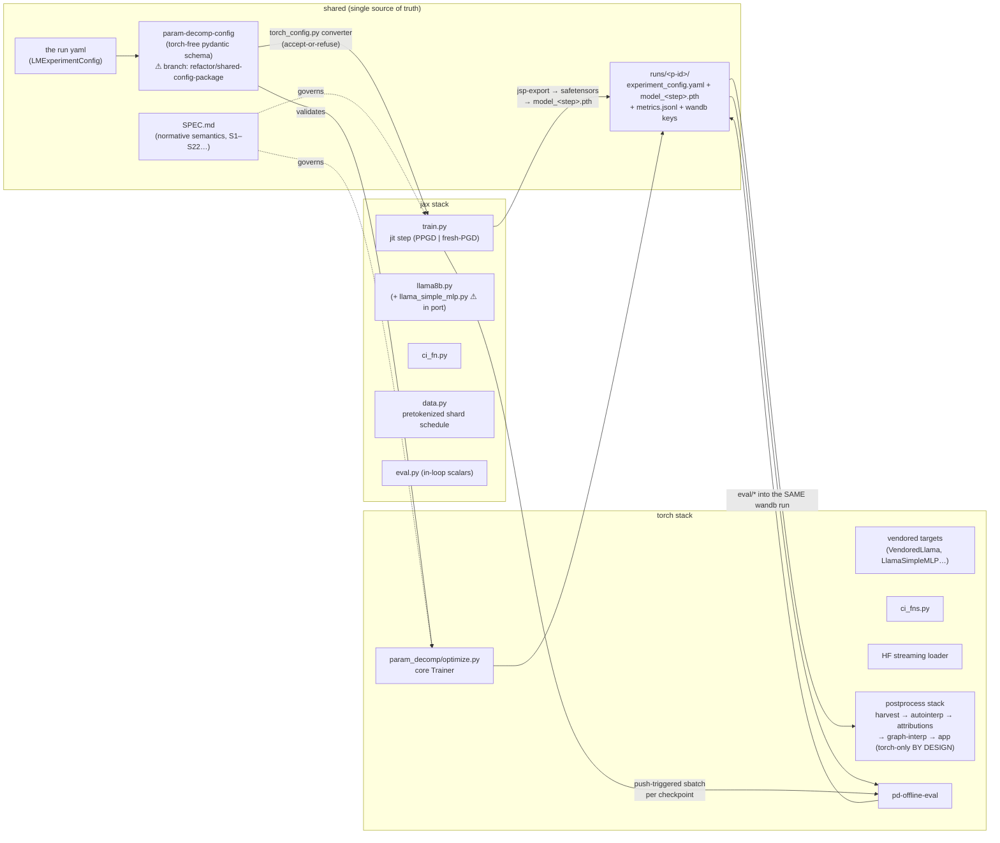

# JAX ↔ torch integration map

State of the union between the JAX single-pool trainer and the torch stack
(2026-06-11). Three kinds of module: **shared** (one artifact both stacks consume),
**replicated** (two implementations of one spec, equivalence-tested), and
**bridges** (one-way glue). The end-state principle: *configs, run artifacts, specs,
and postprocess are shared; only the training computation itself is replicated.*

## Module-by-module

| Concern | torch | jax | status |
|---|---|---|---|
| **Config schema** | `param-decomp-config` (extracted) | same package via git dep + `torch_config.py` converter | SHARED — ⚠ branch unreviewed; jax also keeps parallel internal dataclasses (see gap 2) |
| **Run identity & dir** | `generate_run_id` → `runs/<p-id>/` | wrapper `run_id` → same layout, same files | SHARED — ⚠ live C49k run pre-dates scheme (gap 6) |
| **Checkpoints** | `model_<step>.pth` (torch pickle) | orbax sharded → bridged via `jsp-export` + materialization | BRIDGED one-way (sufficient: postprocess is torch-only by design) |
| **Trainer core** | `optimize.py` / `train_step.py` | `train.py` | REPLICATED under SPEC.md; loss-term + trajectory equivalence tested |
| **Targets** | vendored classes | per-target `DecomposedLM` providers | REPLICATED; Llama-8B done, `LlamaSimpleMLP` ⚠ in port; torch fixtures pin every port |
| **CI fn** | `ci_fns.py` | `ci_fn.py` | REPLICATED; ⚠ two known numeric divergences (gelu tanh/erf, rms-norm eps) |
| **Adversary** | PPGD (all scopes) + fresh PGD | PPGD (broadcast only) + fresh PGD (both scopes) | REPLICATED; ⚠ persistent `per_batch_per_position` unimplemented jax-side (gap 5) |
| **Stoch recon / routing** | `masks.py` routers | `ReconPlan` samplers | REPLICATED; distributionally matched (uniform-k ≡ double-argsort) |
| **Data** | HF streaming + buffer shuffle | deterministic pretokenized shard schedule | DIVERGENT BY DESIGN (determinism, O(1) resume, no-HF-at-runtime); parity = same corpus, not same order |
| **In-loop eval** | `EvalLoop` + metric classes | `eval.py` (scalar core, identical wandb keys) | REPLICATED (scalars); heavy/plot metrics deliberately NOT replicated — they run via the bridge |
| **Offline/slow eval** | `pd-offline-eval` | push-triggered per checkpoint | SHARED (torch impls serve both stacks) |
| **Postprocess & app** | the whole stack | — | SHARED via the run-dir contract; zero jax-specific code |
| **Launch/ops** | `pd-lm --dp N` (snapshot ref + in-job `/tmp` clone) | `pd-jax-lm` (same snapshot machinery; submit-time shared-FS workspace with both venvs, since 8 srun tasks/node would race in-job clones) | SHARED (`generate_run_id` / `create_git_snapshot` / `SlurmConfig` / `submit_slurm_job`) |
| **Logging** | `train/*`, `eval/*` keys | byte-identical keys (+ `jax_runtime` truth section) | SHARED panels |

## Remaining gaps, in dependency order

> **2026-06-11 update — THE UNIFICATION LANDED**: gaps 1, 3, 4-partial, and 8 closed
> in one pass. Everything now lives on `feature/fsdp-lm-trainer` in one checkout:
> `param_decomp_config/` merged (with the shape-spelled scope renames + legacy-alias
> validators), the JAX distribution merged in as `param_decomp_jax/` (spike dirs
> deleted), scope literals synced across both stacks. The frozen `~/pd-nano-jax-jaxsp`
> clone serves the live run's requeues until it ends.
>
> **2026-06-11, later — gaps 2 and 4 closed.** `train.py` consumes the shared loss
> configs directly (`ImportanceMinimalityLossConfig`, `PersistentPGDReconLossConfig` /
> `PGDReconLossConfig`; the internal `LossCoeffs`/`ImpMinConfig`/`SourceAdamConfig`/
> `FreshPGDConfig` mirrors are gone — the factory asserts the implemented subset);
> the native jax yaml schema is deleted (wrapper-only), `run_id` is required (stamped
> by `pd-jax-lm`), and the run dir pins one torch yaml (`experiment_config.yaml`).
> The "gated on C49k" reasoning died with `pd-jax-lm`: live runs execute from
> immutable workspaces, so nothing in this checkout can touch them. Internal state/
> bundle NamedTuples became registered frozen dataclasses. Still open: 5-7.

1. **Merge `refactor/shared-config-package`** (torch repo; awaiting Oli's review). Unblocks: pin the jax git dep to main; delete the mirrored-schema risk forever.
2. **Collapse the jax-internal config dataclasses.** `config.py`'s `ExperimentConfig` tree duplicates information the shared schema already carries; after (1), the converter could emit/consume the shared types directly plus a small jax-runtime-knobs struct (`remat`, identity). Kills the last duplicated schema.
3. **Merge `feature/jax-site-generality`** (gate: the live C49k run ends — checkpoint pytrees are incompatible and requeues execute from the live tree). Brings q/k/v/o + per-site C + fresh-PGD + `LlamaSimpleMLP` to mainline.
4. **Delete the transitional arms** (same gate): native jax yaml schema, the `run_id`-optional wrapper arm, the `torch_config.yaml`/`experiment_config.yaml` double pin → one config name, wrapper-only, id-required.
5. **PPGD `per_batch_per_position` (persistent)** — explicitly descoped earlier; implement when a run needs it (the fresh-PGD work built most of the plumbing: scoped source shapes already exist).
6. **CI-fn numeric unification** (gelu → erf, rms eps → torch's): trajectory-perturbing, so schedule at a run boundary; ~2 lines + fixture refresh.
7. **C49k identity migration** post-run (rename to a `p-` id + config alias), then every live run speaks the contract.
8. **Repo geometry** (the structural one): both stacks are branches of ONE GitHub repo, but the jax branch carries a months-stale copy of the torch tree. True end-state: the jax distribution merges onto the torch mainline as a sibling workspace member, so one branch holds both stacks and the shared package is an in-tree path dep rather than a git-ref pin. Do after (1)+(3) to avoid merging stale torch code backwards.

Everything not listed (eval keys, run contract, export, ops) is converged and validated in production.
