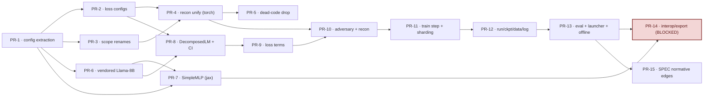

# VPD JAX Single-Pool — Parity Matrix & Stacked-PR Plan

Branch: `feature/jax` (372 commits). Torch single-pool reference under `param_decomp/` +
`param_decomp_lab/`; JAX trainer under `param_decomp_jax/jax_single_pool/`. Shared
torch-free config schema in `param_decomp_config/`. Normative semantics live in
`param_decomp_jax/jax_single_pool/SPEC.md` (invariant IDs `S*`/`N*`/`D*`/`R*`);
loss factoring in `LOSS_PARITY_DESIGN.md`.

Status legend: **done** = numerically/structurally faithful; **partial** = supported
subspace faithful, rest deliberately refused or unverified; **missing** = real gap;
**na-by-design** = intentionally not ported (out of scope / superseded by a different
mechanism).

---

## Part 1 — Feature-Parity Matrix

### 1. Recon losses (training-step math)

The torch recon `Metric` classes factor into JAX `ReconForward × ReconLossTerm` via
`build_recon_terms` (the cartesian product of *mask-source strategy* × *plan shape*).
All recon KL terms share one normalization: `Σ sum_kl / Σ n_positions` (torch) ==
`mean over forwards of kl_per_position` (JAX), since every forward shares `(B,T)`.

| Feature | Torch ref | JAX ref | Status | Invariant(s) | Risk/Note |
|---|---|---|---|---|---|
| Recon normalization (`sum_kl/n == mean-over-forwards`) | `batch_and_loss_fns.py:61`; `metrics/stochastic_recon.py:32` | `losses.py:10`; `train.py:415,418` | done | S10/S10′/N3 | KL direction confirmed identical (P=clean, Q=masked). |
| `UnmaskedReconLoss` → `ConstantSources(1.0)`, route-all | `metrics/unmasked_recon.py:17,24` | `recon.py:297`; `train.py:204` | done | S10′/S1 | JAX pays `x@Δ*0` delta matmul torch omits; loss identical (`has_delta` static flag deferred, §4b). |
| `CIMaskedReconLoss` → `ConstantSources(0.0)`, route-all | `metrics/ci_masked_recon.py:17,24` | `recon.py:297`; `train.py:204` | done | S10′/S1/S5 | Same delta-matmul-vs-skip note. Uses `ci.lower_leaky`. |
| `CIMaskedReconSubsetLoss` → routed subset, n_draws=1 | `metrics/ci_masked_recon_subset.py:18`; `masks.py:155` | `recon.py:301,192` | done | S10′/S11 | uniform_k matches torch double-argsort distribution (R2 permits RNG-bit divergence). |
| `CIMaskedReconLayerwiseLoss` → `per_site_plan`, one fwd/site | `metrics/ci_masked_recon_layerwise.py:17,27` | `recon.py:305,225` | done | S10′/S2 | Single-key mask_infos == JAX `live_sites=(site,)`; others frozen. |
| `StochasticReconLoss` → `route_all_n(n)`, `StochasticSources` | `metrics/stochastic_recon.py:19`; `masks.py:210,236` | `recon.py:308`; `train.py:178` | done | S10′/S1/R1 | JAX draws sources in bf16 COMPUTE_DT (matches torch autocast, N2); Bernoulli(0.5) matches; RNG bits differ (R2). |
| `StochasticReconSubsetLoss` → sampler × n, stochastic | `metrics/stochastic_recon_subset.py:19`; `masks.py:239` | `recon.py:313,148` | done | S10′/S11/R1 | Source AND routing drawn fresh per sample, independence preserved (R1). |
| `StochasticReconLayerwiseLoss` → per-site × `route_all_n(n)` | `metrics/stochastic_recon_layerwise.py:19,41` | `recon.py:317` | done | S10′/R1 | Joint-then-split (torch) == independent per-forward (JAX): same multiset of forwards, same mean. |
| `ChunkwiseSubsetReconLoss` → `subset_chunk_plan` (production stochastic term) | `param_decomp_config/losses.py:93` (config only) | `recon.py:327,207` | done | S10/S11/S10′ | **Asymmetry**: lab Metric class NOT runnable on this branch (absent from `dispatch.py` `LOSS_METRIC_CLASSES`); only the config schema exists. JAX runs it as the production term; its torch parity reference is **off-branch** (n-pool `feature/fsdp-lm-trainer`). Pinned by stacked-parity fixtures. |
| `PGDReconLoss`/`PGDReconSubsetLoss` → `FreshPGDSources`, routing once/step | `metrics/pgd_utils.py:65,89,140`; `metrics/pgd_masked_recon.py:42` | `recon.py:333`; `train.py:303,339` | done | S24/S12′/S15 | torch AVGs c-scope grad before `sign()`; JAX takes `sign(global grad)`. `sign(avg)==sign(sum)` so equivalent — **but no multi-device invariance test for fresh-PGD c-scope** (open Q). |
| `PGDReconLayerwiseLoss` → per-site independent fresh-PGD | `metrics/pgd_masked_recon_layerwise.py`; `losses.py:152` | `recon.py:342`; `train.py:308` | done | S24/S2 | Inferred from LOSS_PARITY_DESIGN row (not read line-by-line); each entry gets own `fold_in(term_key, entry_idx)` init. Low risk; flag for confirming read if ever exercised. |
| `PersistentPGDReconLoss` → `PersistentSources`, `n_warmup+1` Adam ascents | `metrics/persistent_pgd_state.py:298,328`; `metrics/persistent_pgd_recon.py:214,221` | `train.py:263,436`; `adversary.py:92` | done | S13′/S14′/S15/S23/S24/N1 | Production adversary. Fused final ascent reuses main backward grad /coeff (S14, requires S23 one-bundle-per-term). All critical points confirmed. |
| `PersistentPGDReconSubsetLoss` → loss routes subset, **warmup routes ALL** | `metrics/persistent_pgd_state.py:321`; `metrics/persistent_pgd_recon.py:46`; `losses.py:265` | `recon.py:351`; `train.py:273` | done | S24/S13′/S14′ | The S24 quirk faithfully replicated but **provisional pending team decision** (torch `state.py:321` WARNING). |
| `StochasticHiddenActsReconLoss` (per-element MSE on module acts) | `metrics/stochastic_hidden_acts_recon.py:62,128` | — | na-by-design | — | Deliberately on the offline-eval bridge: needs a 5th seam (masked site outputs) + per-element norm; `build_recon_terms` raises on it (`recon.py:358`). Stage 4 deferred. |
| Mask interpolation + delta-channel (S1) all strategies | `masks.py:165,230`; `pgd_utils.py:107`; `persistent_pgd_state.py:410` | `adversary.py:123`; `train.py:198,215` | done | S1 | Source cast to ci dtype (bf16) before interpolation; grad flows through cast (matches torch autocast). |
| Per-term coeff + config-order RNG keying | `metrics/dispatch.py:64,67` | `recon.py:282`; `train.py:309,375` | done | S10′/R1 | Per-step term key `fold_in(key, 1+term_idx)` over ALL terms (stable). Persistent **init** key uses `fold_in(src_key, term_idx)` over persistent-only dict — different index space; harmless for one persistent term, note if multiple added. |
| Persistent source LR schedule (`warmup_then_constant_lr`) | `param_decomp_config/schedule.py:39`; `persistent_pgd_state.py:280` | `losses.py:61`; `recon.py:262`; `train.py:265` | partial | S13′ | Only constant+linear-warmup supported; cosine/linear source-LR decay refused. Numerically equal for production (2.5% warmup). |
| Refused persistent variation points (nsc/sigmoid/start_frac>0/sign) | `persistent_pgd_state.py:205,270,78`; `persistent_pgd_recon.py:136` | `recon.py:255`; `adversary.py:36` | partial | S15/S16 | `_assert_supported_persistent` refuses loudly. Spec-acknowledged (§6 "jax: sc only today"). Fresh-PGD does support c/bc/bsc. Stage 4 deferred. |
| `TrainState.sources` keyed dict + ckpt round-trip | `persistent_pgd_state.py:284`; `persistent_pgd_recon.py:229` | `train.py:70`; `run_state.py:53` | done | S22/S23 | `term_coeff_by_state_key` asserts `set(state_keys)==set(persistent)` (S23 guard). |

### 2. Faithfulness & importance-minimality (pure scalar terms)

| Feature | Torch ref | JAX ref | Status | Invariant(s) | Risk/Note |
|---|---|---|---|---|---|
| Faithfulness: global MSE `Σ‖W−V@U‖²/Σnumel` | `metrics/faithfulness.py:14-54`; `component_model.py:507`; `components.py:122` | `losses.py:21`; `llama8b.py:434`; `llama_simple_mlp.py:424` | done | S17 | Verified `faith=0.10001952` @ RTOL 2e-4 vs torch. MSE over **weights** not acts. |
| Faithfulness fp32 delta math (autocast discipline) | `train_step.py:212-238` | `train.py:369`; `llama8b.py:437,301` | done | N2/N3 | fp32 masters minus fp32 (V@U), out of autocast. Distinct from the bf16 path-delta divergence (in scope for forward, not faithfulness). |
| Imp-min per-site grouping (never merged) | `metrics/importance_minimality.py:40-74` | `losses.py:31` | done | S7 | log2(1+sum) is convex per-site; no site merging either side. |
| Imp-min global per-component sum inside log2 (Jensen) | `importance_minimality.py:70,156-172` | `losses.py:44-48` | done | S8/D2 | torch: autograd-aware `all_reduce(SUM)` + `n*world_size`; JAX: `jnp.sum` over global (B,T) axes IS the global sum (GSPMD). Mechanism differs, semantics identical. |
| Imp-min assembly `lp + beta·entropy` + `no_beta` proxy | `importance_minimality.py:77-85,174-185` | `losses.py:31`; `train.py:370,420,477` | done | S7/S8 | Verified `imp=42.345` vs torch. SPEC §4.3 factored form is algebraic rewrite of `lp+beta·entropy`. |
| Imp-min eps-inside-power `(ci+eps)^p` | `importance_minimality.py:49`; `losses.py:52` | `losses.py:45` | done | S9 | Same shared config field, default 1e-12. |
| Imp-min pnorm linear annealing 2.0→0.4 | `importance_minimality.py:16-37`; `context.py:39`; `losses.py:47` | `losses.py:52`; `train.py:245` | done | S9 | JAX **refuses constant-p** (`p_anneal_final_p is None`) — `train.py:122` asserts not-None. Deliberate narrowing, spec-silent. |
| Imp-min bf16 input → fp32 reduction | `importance_minimality.py:146`; `train_step.py:142,225`; `component_model.py:484` | `train.py:366`; `losses.py:43` | done | N3/S5 | **Subtle seam**: JAX casts ci→fp32 BEFORE `(ci+eps)^p`; torch forms a bf16 intermediate then sums. Not exercised by the fp32-only equivalence fixture. Accepted under N3 (fp32 masters dominate). |

### 3. Adversary (PPGD / fresh-PGD)

| Feature | Torch ref | JAX ref | Status | Invariant(s) | Risk/Note |
|---|---|---|---|---|---|
| Persistent vs fresh-PGD as two distinct adversaries | `persistent_pgd_state.py:158,96`; `pgd_masked_recon.py:42`; `pgd_utils.py:140` | `adversary.py:1,36,52`; `train.py:263,308` | done | S12/S13/S14/S23/S24 | Share only source→mask. Persistent: state across steps + n_warmup+1 ascents; fresh: re-init/step, no state. |
| PPGD warmup route-ALL quirk | `persistent_pgd_state.py:321,328,330` | `train.py:273,275` | done | S24 | Hardcoded `AllLayersRouter` in warmup; subset PPGD unreachable in JAX (refused), so the subset divergence can't bite today. |
| PPGD warmup forward count vs n_samples | `persistent_pgd_state.py:330,336,357` | `train.py:273,294` | partial | S13/S24 | torch averages n_samples route-all forwards; JAX uses ONE. **No-op for route-all** (no routing variance), production n_samples=1. Spec-silent on warmup forward count. |
| Fused (N+1)th persistent ascent, unscaled by coeff (S14) | `persistent_pgd_recon.py:213,217,220`; `train_step.py:262-267` | `train.py:402,425,438,441,443` | done | S14/S23/D1 | torch: 2nd `autograd.grad` w/ retain_graph; JAX: divides fused scaled grad by coeff. JAX is **stricter** (reuses same graph, no chance of post-update θ). Requires coeff≠0 + S23. |
| Source-grad reduction AVG not SUM (historical bug) | `persistent_pgd_state.py:243,253,333`; `pgd_utils.py:76,79` | `train.py:137,143,248`; `adversary.py:104` | done | S16/D1/D3 | **Historically dangerous** (3-pool SUM bug). JAX gets AVG free from GSPMD via global-N normalization in `kl_per_position`. **Open Q**: no HLO/invariance assertion that the cotangent into a replicated source leaf is MEAN not SUM. |
| Clamp-to-[0,1] after EVERY ascent | `persistent_pgd_state.py:257,266,268`; `pgd_utils.py:86,87` | `adversary.py:111,112,48`; `train.py:347` | done | S15 | Sharp teeth: unprojected drift past 1 → zero clip grad → entry dies. Guarded both sides. |
| Source Adam optimizer parity (bias correction, eps after sqrt) | `persistent_pgd_state.py:113,121,125,126` | `adversary.py:92,103,113,114` | done | S15/N1 | eps placement (after sqrt, inside denom) — common trap, correct. Production betas (0.5,0.99). Sign optimizer documented but persistent is Adam-only in JAX. |
| Source LR stepped once/training step | `persistent_pgd_state.py:280`; `persistent_pgd_recon.py:141`; `schedule.py:37-46` | `train.py:265`; `losses.py:61`; `recon.py:262` | done | S13 | **warmup_pct==0 edge**: torch yields full lr at step 0; JAX yields 0 (warmup_steps clamped to max(.,1)). 1-step divergence only at pct==0; production 2.5% unaffected. |
| Fresh-PGD single routing draw shared across ascents+main fwd | `pgd_utils.py:155,156,89` | `train.py:314,316,382`; `recon.py:83` | done | S24 | Fresh sources `stop_gradient`'d before main loss → enter as constants. JAX ascent uses non-remat fwd, main uses checkpointed — same math. |
| Scopes c/sc/nsc/bsc (persistent sc-only; fresh c/bc/bsc) | `persistent_pgd_state.py:205,390,395`; `pgd_utils.py:48` | `adversary.py:36,48,52`; `recon.py:258` | partial | S16/D3 | Persistent c/nsc/bsc refused (production=sc). Fresh c/bc/bsc all implemented. **Open Q**: confirm fresh 'c'/'bc' init key replica-identical (relies on step-derived key being replicated). |
| Source→mask materialization + raw delta channel | `persistent_pgd_state.py:411,413,415`; `pgd_utils.py:107,109` | `adversary.py:123,134,135` | done | S1 | Delta channel `[...,-1]` raw (no ci interp). Source cast fp32→bf16 before interp, grad flows back. |
| Checkpoint round-trip of persistent adversary state | `persistent_pgd_state.py:284,291`; `persistent_pgd_recon.py:228,234` | `train.py:70,73`; `adversary.py:28` | done | S22 | JAX first-class in TrainState (no lazy-construction dance). Verify orbax includes `sources_opt_state` at production topology (jsp SIGTERM lore). |

### 4. CI function & sigmoids

| Feature | Torch ref | JAX ref | Status | Invariant(s) | Risk/Note |
|---|---|---|---|---|---|
| `lower_leaky_hard` (grad-sign-gated custom VJP) | `ci_sigmoids.py:24-53,82-87` | `ci_fn.py:34-48` | done | S5/S6 | **Verified**: `_lhs_b` is bit-identical nested `where` incl `<=` tie-breaks. **RISK: no unit test anywhere** for this custom backward — the single most subtle numeric, unverified by any fixture. Recommend a 1-input grad check. |
| `upper_leaky_hard` (ordinary autodiff) | `ci_sigmoids.py:73-79` | `ci_fn.py:51-55` | done | S5/S6 | Identical expression. Same untested-by-fixture caveat. |
| Same-logits two-squashing invariant | `ci_fns.py:249` | `ci_fn.py:118-131,27-31` | done | S5 | Both squashings from one `logits`; lower→masks, upper→imp-min only. |
| Shared transformer arch (pre-norm, weightless RMS, bidir RoPE) | `ci_fns.py:156-254`; `ci_nn_blocks.py:99-176` | `ci_fn.py:62-131` | done | S4/S5 | Structure matches. Absent from equivalence fixtures (CI transformer not in harness). torch 2D-input squeeze path (TMS/resid_mlp) has no JAX analog (LM-only). |
| GELU variant: erf (both) | `ci_nn_blocks.py:167`; `ci_fns.py:40,68,93,129` | `ci_fn.py` (`approximate=False`) | done | S6 | Unified with torch (#624/#730 resolved): `jax.nn.gelu(..., approximate=False)` = exact-erf, matching torch `nn.GELU()`. CI-fn transfer bit-faithful on this op. |
| RMSNorm eps: finfo(fp32) (both) | `ci_nn_blocks.py:174`; `ci_fns.py:229` | `ci_fn.py` (`CI_FN_RMS_EPS`) | done | S4 | Unified with torch (#625/#730 resolved): JAX eps = `finfo(fp32).eps` ~1.19e-7, matching torch `F.rms_norm` default. RMS upcasts to fp32, so fp32 finfo governs. |
| **Site concat/split ORDER: lexicographic (torch) vs numeric+KIND_ORDER (JAX)** | `ci_fns.py:179-181,117-119` | `llama8b.py:105-115,41`; `ci_fn.py:113-131` | partial | S4/S5 | **jax-deviates.** torch `sorted()` is lexicographic (layers.10 before layers.2; mlp.down,gate,up; attn.k,o,q,v); JAX numeric-layer+KIND_ORDER. Each impl self-consistent so fresh training unaffected, but **blocks torch→JAX CI-fn transfer** and cross-impl CI-transformer numeric parity. Export bridges via `_concat_permutation`. Highest-impact finding. |
| `inv_freq` RoPE buffer stop-gradient | `ci_nn_blocks.py:62-63,76-78` | `ci_fn.py:115,174,102` | done | — | Behaviorally equivalent. JAX explicit `stop_gradient` (leaf else optax-updated). No numbered invariant — recommend adding. |
| RoPE rotate-half | `ci_nn_blocks.py:53-96` | `ci_fn.py:84-85`; `vendored_jax/llama.py:87-104` | done | — | Reuses vendored rope. base 10000 hardcoded in JAX (`ci_fn.py:174`) vs torch config-threaded — config-fidelity gap, harmless at default. |
| Attention scaling (SDPA default 1/√d_head) | `ci_nn_blocks.py:134-136` | `ci_fn.py:87-89` | done | — | Both bidirectional, default scale. Bit-parity not guaranteed across cudnn vs torch-flash (accepted SDPA tolerance). |
| Weight init (Kaiming custom, PyTorch-default attn, zero bias) | `components.py:38-58`; `ci_nn_blocks.py:21-50,113-116`; `ci_fns.py:191` | `ci_fn.py:142-187` | done | — | Distribution parity, NOT RNG-stream parity — fresh JAX/torch start from different same-distribution inits. Not a transfer path. |
| fp32 masters / bf16 compute for CI fn | `ci_fns.py:156-254` | `ci_fn.py:10-12`; `train.py:254,367` | done | S5 | Detached pre-pass ci for ascents, live ci for main losses. RMS upcasts to fp32 internally; combined with eps mismatch this is where bf16 CI numerics diverge most. |
| Per-site head-logits split | `ci_fns.py:219-254,368-370` | `ci_fn.py:122-131` | done | S5 | Self-consistent each impl; inherits the site-order deviation. |
| Non-transformer CI fns (MLP/VectorMLP/Shared/GlobalShared) | `ci_fns.py:23-145,257-340` | — | na-by-design | S5 | Production CI fn is global_shared_transformer only. Embedding-input path absent (JAX decomposes only `nn.Linear`). |

### 5. Component model: masks & forward

| Feature | Torch ref | JAX ref | Status | Invariant(s) | Risk/Note |
|---|---|---|---|---|---|
| `site_out` decomposed linear `((x@V)*mask)@U` | `components.py:143-152,218-221` | `llama8b.py:296-299`; `llama_simple_mlp.py:281-284` | done | S1 | Mask gates component acts before `@U`. torch stores W `[d_out,d_in]`; JAX V/U `[d_in,C]/[C,d_out]` — same map. |
| Raw delta channel (C+1), fp32-vs-bf16 path | `components.py:154-160`; `masks.py:228-238`; `component_model.py:507` | `adversary.py:134`; `llama8b.py:300-305,434` | done | S1/N2 | bf16 delta-on-path is intentional (SPEC N2). Faithfulness uses separate fp32 delta. |
| `mask = ci + (1-ci)*source` | `masks.py:165-175,222-228` | `adversary.py:134`; `train.py:198,214` | done | S1/S5 | Identical across all 3 JAX source paths + torch. |
| Non-live site frozen `x@W` — two realizations (S2) | `component_model.py:369-377,304-308`; `ci_masked_recon_subset.py:26` | `llama8b.py:363-431`; `recon.py:207-237` | done | S2 | (a) static `live`-set gate (chunk plan); (b) per-position route fallback. torch single-pool subset uses only (b); JAX (a) only via `subset_chunk_plan`. **Verify the equivalence harness exercises a chunk plan.** |
| Per-position routing fallback `where(route, y_dec, x@W)` | `component_model.py:369-373`; `masks.py:127-152` | `llama8b.py:306-307`; `recon.py:135-145` | done | S2/S11 | uniform-k draw distribution matches (S11). |
| `clean_logits` = frozen-path forward, not mask=1 identity | `train_step.py:141,150`; `component_model.py:298,379` | `llama8b.py:319-326`; `llama_simple_mlp.py:303`; `train.py:249` | done | S3 | **Structural diff**: torch single-pool reference here is WHOLE-frozen-forward, NOT residual-start; JAX uses suffix-only over harvested residual. Equivalent under stop-grad, but SPEC S3/S18 describe residual-start as contract — tighten wording. |
| CI inputs = clean frozen-path site inputs (S4) | `train_step.py:141-146`; `component_model.py:350` | `llama8b.py:329-360`; `llama_simple_mlp.py:313-346` | done | S4 | SimpleMLP uses gelu(tanh) for down_in vs Llama silu — target-specific, correct. |
| Delta component C+1 channel sizing | `masks.py:230-238`; `components.py:71-74` | `adversary.py:47,73`; `train.py:199-201` | done | S1 | Stochastic delta is a separate `[B,T]` draw (not a C+1 channel). Constant path zeros delta vs torch skips it — identical value, compute diff. |
| Per-site C (heterogeneous) | `decomposition_targets.py:21`; `component_model.py:165`; `components.py:255` | `lm.py:36-42`; `llama8b.py:258-278`; `ci_fn.py:185` | done | S5 | Production uses one C; machinery per-site both sides. |
| **Site ordering: canonical (JAX) vs insertion/lexicographic (torch)** | `component_model.py:165-171`; `masks.py:152` | `llama8b.py:41-43,105`; `lm.py:76-84`; `llama_simple_mlp.py:153` | partial | S5/S7 | Coincide on production single-MLP-family; **diverge for multi-layer/mixed configs**, affecting CI concat/split AND per-step RNG key-folding order. SPEC §3 says "fixed site order" but doesn't pin WHICH. Needs a spec decision + multi-site fixture. |
| Mask/source broadcasting over batch (scope-shaped) | `components.py:154-160`; `persistent_pgd_state.py:42` | `lm.py:51-60`; `adversary.py:42-49`; `llama8b.py:305` | done | S1/S16 | sc-scope `(1,T,C+1)` broadcasts over `[B,T]`. Exercised only on PPGD path — verify a sc forward in the harness so the broadcast axis can't silently transpose. |

### 6. Train step, optimizers & schedules

| Feature | Torch ref | JAX ref | Status | Invariant(s) | Risk/Note |
|---|---|---|---|---|---|
| Two AdamW (betas (0.9,0.999), eps 1e-8, wd 0) | `optimize.py:230-241`; `pd.py:45-54` | `run_state.py:31-37`; `torch_config.py:155` | done | S20 | torch relies on default eps; JAX explicit. wd=0 enforced by `_assert_plain_adamw`. |
| Components grad-clip @ 0.01, CI unclipped | `optimize.py:487-496`; `pd.py:51-54` | `run_state.py:33-37`; `torch_config.py:253` | done | S19 | **Numeric subtlety**: torch `clip_grad_norm_` has `+1e-6` in denom; optax `clip_by_global_norm` has none. At clip=0.01 (almost always fires) → ~1e-4 relative scale diff on component grads every step. Spec-silent. |
| Cosine LR schedule (to 0.1×, no warmup) | `schedule.py:43-64`; `optimize.py:407-413` | `run_state.py:31-32` | done | S20 | **Off-by-one**: torch `step/(steps-1)`, optax `count/steps`. ~2.5e-6 relative/step at 400k; endpoint 0.1× one update later in optax. Negligible, undocumented formula deviation. |
| LR-schedule step alignment (applied vs logged) | `optimize.py:403-413,487-496` | `run.py:291-294`; `run_state.py:31-37` | done | S20 | Applied LR aligns. **Logging** differs: JAX logs `sched(step+1)` (next update's LR); torch logs applied. Cosmetic wandb-curve mismatch. |
| Total optimizer-update count | `optimize.py:400-402,486-496` | `run.py:291-294` | done | — | Both exactly `steps` updates. torch terminal no-op iter is log/ckpt-only. |
| Per-step hook ordering | `train_step.py:238-268`; `optimize.py:404-496` | `train.py:252-356,425-462` | done | S13/S14/S19/S20 | Matches SPEC §4.5. zero→set-LR→[warmup]→ascents→fused backward→final ascent→clip→two steps. |
| Faithfulness warmup (S21) | `faithfulness_warmup.py:19-53`; `optimize.py:394` | `run.py:197-224`; `train.py:494-508` | done | S21 | 400× AdamW(1e-3) on faith only, then discard. JAX hardcodes warmup wd=0 but **guards it** (`torch_config.py:235` asserts ==0). |
| Faith-warmup resume skip (loader replay vs O(1)) | `optimize.py:386-395` | `run.py:189-196,244` | na-by-design | S18/S21/S22 | torch replays loader N batches; JAX pure `(seed,step)` schedule. Token batches differ between impls regardless. |
| `get_scheduled_value` general semantics | `schedule.py:37-64`; `train_step.py:187` | `losses.py:61-65`; `run_state.py:31` | partial | S13/S20 | JAX splits into 2 specialized fns (cosine main + warmup-then-constant source). Source schedule supports NO post-warmup decay — a decaying source schedule would **silently not decay**. Verify torch_config asserts source schedule constant-after-warmup. |
| `cross_pool_clip_grad_norm` | `grad_clip.py:25-61`; `optimize.py:489` | — | na-by-design | S19 | Dead on this branch (n-pool lineage, not imported by any non-test module). The single-pool clip JAX must match is `clip_grad_norm_` (+1e-6 form). |

### 7. Distributed / data-parallel

JAX obtains torch's procedural DDP semantics *structurally*: data sharded `P('dp')`,
params/V-U/CI-fn sharded (FSDP analog), frozen target + sc-source **replicated**, every
loss written as a global mean — `jax.jit`+GSPMD inserts all collectives.

| Feature | Torch ref | JAX ref | Status | Invariant(s) | Risk/Note |
|---|---|---|---|---|---|
| Shared-scope PGD source grad reduction (AVG / autodiff-of-global-mean) | `persistent_pgd_state.py:243,251,333`; `persistent_pgd_recon.py:217` | `llama8b_sharding.py:113`; `train.py:362,438` | done | D1/S16/D3 | JAX gets AVG free via replicated leaf + global-mean loss. Correct as long as source stays replicated. bsc (batch-sharded) source would need different handling — sc-only today. |
| Shared-source replica-identity | `persistent_pgd_state.py:41,227,229` | `llama8b_sharding.py:113`; `adversary.py:36`; `train.py:70` | done | S16/D3 | JAX structural (init via jit `out_shardings=replicated`); no broadcast needed. Cleaner than torch. |
| `scope_needs_replica_sync` gate | `persistent_pgd_state.py:41,189` | `llama8b_sharding.py:113`; `adversary.py:36` | partial | S16 | JAX only sc; the replicated-vs-batch-sharded decision not generalized. bsc/nsc persistent deferred (Stage 4). |
| Imp-min global sum inside log2 (Jensen-correct) | `importance_minimality.py:156,161,55,73` | `losses.py:31,45`; `train.py:370` | done | D2/S7/S8 | torch autograd-aware `all_reduce(SUM)`; JAX `jnp.sum` over global (B,T). **Open Q**: eval-path imp-min (torch `compute()` uses non-autograd reduce) parity unverified. |
| Per-rank recon mean as source-grad objective | `persistent_pgd_state.py:298,333`; `persistent_pgd_recon.py:168,214`; `train_step.py:263` | `train.py:273,288,438,441` | done | D1/S13/S14 | JAX is stricter satisfaction of S14 (reuses same graph). |
| `shard_batch` / `make_array_from_process_local_data` topology | `distributed.py:198` | `sharding.py:50,75`; `run.py:97`; `llama8b_sharding.py:135` | done | D4/R3 | Correct for single-process-many-device AND multi-process-1-device. Do NOT revert to per-`process_index`-slice idiom. |
| Counter-based RNG layout invariance | `distributed.py:198,206` | `run.py:294`; `train.py:309,379,386` | done | D4/R3/R1 | **JAX satisfies a STRONGER invariance than torch** (R3 deliberate per-rank divergence); spec-blessed deviation. Per-step key identical across processes. |
| Params/V-U/CI-fn sharding (FSDP analog) + grad reduction | `distributed.py:163` | `llama8b_sharding.py:61,92,56`; `train.py:453` | done | D1/N1 | Semantically-invisible memory opt (spec-silent). Every site's C must divide mesh size (hard constraint torch lacks). |
| `use_reduction_group` / subgroup collectives | `distributed.py:79,88,110,163` | — | na-by-design | — | n-pool only. Single-pool has no pool coordination. |

### 8. Checkpoint / resume

| Feature | Torch ref | JAX ref | Status | Invariant(s) | Risk/Note |
|---|---|---|---|---|---|
| What round-trips (trajectory vs frozen target) | `training_state.py:28-34`; `optimize.py:304`; `persistent_pgd_state.py:284,133` | `train.py:65-74`; `run_state.py:63-71`; `checkpoint.py:6-9` | done | S22/N1 | Frozen target excluded, rebuilt from HF. Schedules pure fns of step. |
| Optimizer state keying (topology independence) | `optimize.py:84-129`; `training_state.py:23` | `checkpoint.py:45-50`; `run_state.py:3-7,66` | na-by-design | S22 | torch name-keyed; JAX orbax reshard onto reference shardings. JAX resume onto a DIFFERENT C-shard count not exercised (smokes resume at same topology). |
| Persistent source + Adam-moment round-trip | `persistent_pgd_state.py:284,133`; `persistent_pgd_recon.py:229` | `train.py:70-73`; `adversary.py:28-33,84-89`; `run_state.py:53` | done | S22/S13/S15/S23 | torch step_count int; JAX float32 scalar. Verify first post-resume ascent uses bias-correction for count N+1. |
| Loss-metric persistent state lazy-restore | `optimize.py:315,362`; `persistent_pgd_recon.py:235` | `run_state.py:52-62`; `checkpoint.py:45-50` | na-by-design | S22/S23 | torch defers (batch_dims runtime-discovered); JAX shapes known up front, restores eagerly. |
| Format: consolidated .pth vs orbax sharded | `run_sink.py:174-205`; `resumption/config.py:70`; `run_sink.py:31` | `checkpoint.py:22-37,40-50` | done | S22 | JAX sharded writes = "keep hangs off train loop". `use_replica_parallel=False` (jax 0.10 bug workaround). |
| Synchronous save for SIGTERM→requeue | `optimize.py:476-484`; `infra/slurm.py:66,266` | `checkpoint.py:10-43`; `run.py:350-361` | done | S22 | Both synchronous. SIGTERM flag now serviced at the step boundary AND inside faith-warmup (clean exit, no save) + the in-loop eval pass (abandon partial, fall through to save); only the first-jit-compile window stays unserviced. Periodic `save_every` is the backstop (lore: jsp SIGTERM fired 0/6 historically — the two largest unserviced windows are now closed). |
| Resume-with-changed-config refusal | `resumption/config.py:1-8`; `experiments/lm/run.py:302`; `optimize.py:327` | `run.py:399-407,421-427` | done | S22 | JAX byte-compares pinned config (sharp: whitespace/comment edit refuses). torch parent-cfg-is-truth + child run_id. Spec-silent — recommend adding. |
| O(1) data-schedule resume vs loader replay | `optimize.py:389-392,378` | `run.py:244-248,291-292` | done | S22/R1 | jax-deviates (deliberate improvement). |
| Step counter & schedule continuity | `optimize.py:350,407-413,400` | `run.py:189-194,291`; `train.py:10-13,244` | done | S22/S9/S13 | One-step convention offset between impls (torch saves@S re-runs S; JAX saves@step+1 re-runs start_step). Within-impl consistent. |
| keep_last pruning + downstream model artifact | `run_sink.py:198-205,223-274,191` | `checkpoint.py:30-37`; `run.py:350-379` | partial | S22 | **Interop gap**: torch emits `model_<step>.pth` for downstream tools; JAX emits orbax ckpts + separate offline export only. See interop section. |
| Frozen target rebuilt-not-restored | `optimize.py:318-343`; `experiments/lm/run.py:357`; `optimize.py:345` | `checkpoint.py:6-9`; `run.py:436-471,188` | done | S22 | Must rebuild bit-identical (bf16 N1); a different HF revision silently changes the recon target. |
| SLURM requeue: in-place (jax) vs child-run (torch) | `experiments/lm/run.py:295-329`; `resumption/provenance.py:1`; `resumption/config.py:31` | `run.py:188-194,1-13`; `checkpoint.py:53-60` | done | S22 | torch single-pool auto-resume helper has NO caller on this branch (only tests) — in-place auto-requeue is effectively JAX-only here. Anyone expecting torch auto-resume will be surprised. |

### 9. Logging / RunSink / wandb

| Feature | Torch ref | JAX ref | Status | Invariant(s) | Risk/Note |
|---|---|---|---|---|---|
| Rank-aware no-op sink | `run_sink.py:95,128,162` | `run.py:124-127,148,175` | done | — | Equivalent; JAX scatters is-main guards. |
| `metrics.jsonl` local format | `run_sink.py:39-68` | `run.py:127,147-161` | done | — | Same per-line schema. |
| Logged-key namespace `train/loss/*` mapping | `optimize.py:436-472`; `train_step.py:252`; `metrics/output.py:32` | `run.py:106-116,150-156`; `train.py:473-485` | partial | — | **Parity hinges on JAX `term.name == torch instance_key` (loss CLASS name)** — needs verification. JAX-only extras (`train/perf/*`, `mem/*`, `schedules/p_imp`, `lr/src`). |
| Grad-norm logging (per-leaf + summary) | `component_model.py:518-576`; `optimize.py:432` | `train.py:77-96,480` | partial | — | summary/* match; per-LEAF keys do NOT (torch `components/layers.18...V` vs JAX equinox keystr). Won't overlay. |
| Cross-rank metric averaging | `optimize.py:429` | `run.py:304-308`; `train.py:415-418` | done | S8/D2 | Both global-batch via different mechanisms. |
| `slow_eval/*` dedicated step axis | `infra/wandb.py:160`; `optimize.py:468` | `run.py:139-144` | done | — | Axis reproduced. JAX defers ALL slow metrics to offline (matches torch 3-pool, not single-pool). |
| Eval-pass logging (`eval/` namespace) | `optimize.py:448-467`; `train_step.py:273-317`; `metrics/output.py:45` | `run.py:320-348` | partial | — | **Numeric risk**: torch accumulate-then-`compute()` allows non-mean aggregation; JAX per-batch-mean-then-average — DIFFERENT for any non-mean eval metric (Jensen, same class as S8). |
| Console output | `run_sink.py:162`; `optimize.py:439,400` | `run.py:158-161,191` | partial | — | Cosmetic; JAX `%.4g` vs torch 15-decimal, no tqdm. |
| wandb group/tags | `infra/wandb.py:146`; `experiments/utils.py:71`; `experiments/lm/run.py:223` | `run.py:131-138`; `experiment.py:16-20` | **missing** | — | JAX cannot UI-group or tag runs. Workflow gap for sweeps; low training risk. |
| wandb run name + id + resume | `infra/wandb.py:146-154`; `run_sink.py:106` | `run.py:131-138`; `config.py:109-113` | done | — | JAX hardcodes `resume='allow'` (safe: fresh id has nothing to resume). |
| wandb config dump (flattened) | `run_sink.py:135`; `infra/wandb.py:165`; `experiments/utils.py:77` | `run.py:276-286,133-137` | partial | — | JAX passes raw nested dict (no `flatten_typed_lists`, no view_meta). Adds `jax_runtime` topology. Cross-impl config queries won't line up. |
| `log_code` | `infra/wandb.py:156` | `run.py:131-145` | na-by-design | — | JAX provenance = snapshot ref + immutable workspace; log_code redundant. |
| **CommError-swallowing wandb wrapper** | `infra/wandb.py:171-189`; `run_sink.py:160` | `run.py:162-163` | **missing** | — | **Real robustness gap.** A transient wandb hiccup crashes a JAX run that torch survives. Highest-priority parity fix in this area. |
| PIL figures / CustomChart side-channel | `run_sink.py:52-68,216` | `run.py:147-163` | na-by-design | — | JAX in-loop metrics all scalar. Revisit if figure-emitting metric ported. |
| Train-log cadence (periodic + dense + final) | `optimize.py:428,400` | `run.py:296-302,254-258` | done | — | Off-by-one: torch logs step-0 baseline (pre-first-step); JAX 1-based, first log at `log_every`. |
| Checkpoint upload + keep-last pruning | `run_sink.py:174-205,263` | `run.py:188,350-357` | na-by-design | S22 | JAX never uploads ckpts to wandb. `fetch_latest_wandb_checkpoint` won't find a JAX run's ckpt. |
| Perf/memory telemetry | `optimize.py:428-445` | `run.py:309-316` | na-by-design | — | JAX-only additive keys. |
| `block_until_ready` before logging | `optimize.py:415-425` | `run.py:304` | na-by-design | — | Correct JAX async idiom. |
| **Finite-check on logged losses** | `train_step.py:246-259` | `train.py:417`; `run.py:308` | **missing** | — | Fail-fast gap: a NaN/inf loss propagates silently in JAX where torch crashes. Medium priority — wastes multi-day compute. |

### 10. Eval loop / metrics / offline

| Feature | Torch ref | JAX ref | Status | Invariant(s) | Risk/Note |
|---|---|---|---|---|---|
| EvalLoop bundle + cadence (every/slow_every/slow_on_first) | `train_step.py:78-123`; `optimize.py:448-473` | `config.py:90-104`; `run.py:320-348` | partial | — | JAX EvalConfig has NO slow_every/slow_on_first — by design (slow tier entirely offline). Two-process split (fast in-loop + slow offline) undocumented in SPEC. |
| Fast/slow partition (`Metric.slow`) | `train_step.py:295-317`; `metrics/base.py:32` | `eval.py:43-218` | partial | — | JAX in-loop = fast scalar only. Fast attn-pattern recon metrics not implemented (n/a — absent from prod yamls). All slow deferred offline. |
| `CEandKLLosses` (6 masking variants) | `eval_metrics/ce_and_kl_losses.py:91-176`; `masks.py:210`; `batch_and_loss_fns.py:61` | `eval.py:110-166,31-40`; `losses.py:10` | done | S1/N3 | Only stoch_masked carries delta path (both). **N3 eval risk**: torch softmax under bf16 autocast vs JAX casts fp32 before log_softmax — cast-point divergence, not documented for eval. |
| `CI_L0` (per-site + grouped sum) | `eval_metrics/ci_l0.py:18-71`; `eval_metrics.py:58` | `eval.py:63-71,167-177` | done | — | Group-sum semantics match; key format byte-for-byte. |
| `PGDReconLoss` eval probe (fresh sign-PGD, c-scope, 20 step) | `metrics/pgd_masked_recon.py:42`; `pgd_utils.py:37-171`; `losses.py:148` | `eval.py:179-215`; `config.py:81-104` | done | S1/S15 | c-scope only in JAX eval (prod uses c). GSPMD global-mean grad == torch c-scope all_reduce(AVG). |
| Slow/plot metrics (CIHistograms, UVPlots, hidden-acts, etc.) | `eval_metrics/ci_histograms.py:15`; `ci_mean_per_component.py:14`; `stochastic_hidden_acts_recon.py` | `eval.py:1-14` | na-by-design | — | Offline-only. **Risk**: any V/U numeric divergence between JAX export and torch rebuild shows up here with no JAX-side cross-check. |
| `offline_eval` (jsp-export → torch eval, push-triggered) | `experiments/lm/offline_eval.py:60-270` | `run.py:350-394` | done | S22/N1/N2 | **llama8b-only** (guarded). LlamaSimpleMLP slow metrics NEVER computed (pile yaml's CIHistograms/PGD_20step are dead config). |
| `eval`/`slow_eval` wandb key + step-axis | `optimize.py:463-473`; `offline_eval.py:121-149` | `run.py:338-341,143-144` | done | — | JAX averages `sum/n_steps` — exact only for uniform `(B,T)` (holds for fixed shapes). |

### 11. Model loading / data / config

| Feature | Torch ref | JAX ref | Status | Invariant(s) | Risk/Note |
|---|---|---|---|---|---|
| fnmatch `(pattern, C)` → concrete sites | `decomposition_targets.py:29`; `decomposition_target.py:8`; `pd.py:143` | `torch_config.py:80`; `llama8b.py:47`; `llama_simple_mlp.py:166` | partial | S10 | JAX restricts to per-layer q/k/v/o/gate/up/down (or `h.*`); refuses Identity/Embedding/non-matching. Canonicalizes order (must cross-check vs torch first-match order). |
| `target.spec` discriminated union + dispatch | `lm.py:49,15`; `experiments/lm/run.py:88` | `torch_config.py:96`; `config.py:20`; `run.py:439` | partial | — | JAX accepts only Llama-3.1-8B (HF/vendored) + LlamaSimpleMLP (pretrained); GPT-2/other refused at convert. |
| Shared torch-free config schema validated both sides | `experiment.py:53`; `pd.py:113`; `lm.py:104` | `torch_config.py:319`; `config.py:108` | done | — | Single source of truth. 5 wrapper-only keys enforced. Knowingly-ignored torch fields are prose, not asserted. |
| Frozen bf16 + fp32 V/U + fp32 delta upcast | `experiments/lm/run.py:117`; `components.py:71`; `vendored/.../components.py:284` | `llama8b.py:39,284,434`; `config.py` (`supported_weights_dtypes`) | partial | N1/N2 | Two accepted bf16 divergences. **fp32-frozen-target requests are REFUSED at convert** (per-target `supported_weights_dtypes`; both targets bf16-only) — no silent downgrade (issue #727). |
| Vendored Llama-3.1-8B arch (RoPE/RMS/GQA/SwiGLU) | `vendored/llama_3_1/model.py:57,198`; `config.py:20` | `vendored_jax/llama.py:58,77`; `llama8b.py:52` | done | S4 | Line-for-line port; pinned by fixtures. Attn backend differs (bit-exactness not required). |
| LlamaSimpleMLP pile arch (plain RoPE, GELU-tanh, tied head) | `pretrain/models/llama_simple_mlp.py:89,249,313` | `llama_simple_mlp.py:111,261,83` | done | S4 | Pinned by `tests/simple_mlp_equivalence`. SimpleMLP entirely spec-silent (acknowledged second target). |
| Site computation order / clean site inputs (q/k/v before attn) | `vendored/llama_3_1/components.py:125`; `model.py:156` | `llama8b.py:329,382` | done | S4/S2/S3 | JAX short-circuits at last_site_layer (residual-start opt). |
| Residual-start prefix/suffix split | `vendored/llama_3_1/components.py:177,196` | `llama8b.py:141,563`; `run.py:238` | done | S18 | torch has `PD_DISABLE_RESIDUAL_START` escape hatch; JAX structural. Default IS residual-start. |
| Pre-tokenized parquet contract + seeded batch schedule | `experiments/lm/data.py:130,104`; `lm.py:77` | `torch_config.py:171`; `data.py:53,114` | done | S18/R1/R3 | JAX REFUSES HF at runtime. Different batch ordering → trajectories NOT batch-identical across impls (expected). +1 token allowance for the 513-wide pile artifact. |
| `output_extract` handling | `batch_and_loss_fns.py:27`; `experiments/lm/run.py:154` | `torch_config.py:22`; `llama8b.py:326` | na-by-design | — | JAX forwards always emit bare logits. A disagreeing torch `output_extract` would not be caught (low risk). |
| `use_delta_component`/`tied_weights`/`sigmoid_type`/identity gating | `pd.py:164,170,147` | `torch_config.py:232,85` | partial | S1 | JAX hardwires production (delta on, leaky_hard, no ties, no identity); refuses the rest at convert. |
| Optimizer/schedule/faith-warmup config conversion gating | `pd.py:45,198` | `torch_config.py:148,247`; `run.py:197` | done | S19/S20/S21 | A torch schedule with a horizon ≠ `pd.steps` would desync (checked in build_optimizers, not this area). |

### 12. Launcher / SLURM / DDP

| Feature | Torch ref | JAX ref | Status | Invariant(s) | Risk/Note |
|---|---|---|---|---|---|
| `pd-jax-lm` wrapper validation + run-id mint | `experiments/lm/jax_launch.py:45,115,128`; `infra/run_files.py:92` | `torch_config.py:300,304,313` | done | — | Wrapper-key set **triplicated** (jax_launch `_validate_wrapper`, `WRAPPER_KEYS`, launcher append) — drift risk. |
| Immutable shared-FS workspace (clone + both venvs at submit) | `jax_launch.py:68,146,155,164,169` | `torch_config.py:304`; CLAUDE.md | done | — | Submit-time build because jsp runs 8 srun tasks/node. Login-node toolchain mismatch surfaces only at job start. |
| Git snapshot ref machinery (shared with torch) | `infra/git.py:44,99,127`; `infra/slurm.py:285`; `jax_launch.py:70` | — | na-by-design | — | run-id-keyed refs isolate concurrent launches. Resubmit reconstructs ref string without verifying existence (informational only). |
| SlurmConfig + sbatch header (signal/requeue/no-partition) | `jax_launch.py:81`; `infra/slurm.py:42,58,241,88` | `run.py:66,350,358` | done | — | `TERM@300` (no B: prefix) delivers to srun ranks (jsp handler runs IN the rank). `n_gpus` field ambiguous across callers. |
| srun shape (1 task/GPU, block:block, kill-on-bad-exit) | `jax_launch.py:32,94,96`; `infra/ddp_launch.py:94`; `infra/slurm.py:439` | `sharding.py:23,38` | done | D4 | `--ntasks-per-node`/`--cpus-per-task` duplicated in srun line + SBATCH header. SLURM_LOCALID→local device asserted (`sharding.py:33`). |
| jax.distributed bring-up vs torch elastic rendezvous | `infra/ddp_launch.py:21,39,83,101`; `infra/slurm.py:25` | `sharding.py:23,42`; `run.py:416,475` | done | D1/D2/D3/D4 | Different mechanism, semantically equivalent (validated by `invariance_check.py`). JAX sets no NCCL env (doesn't apply). |
| XLA flags (command buffers off, mem 0.92) | `jax_launch.py:38,40,95` | — | done | — | Numerics-irrelevant (throughput/mem only, ~0% cost). Fragile string construction of `XLA_FLAGS`. |
| SIGTERM→save→requeue→resume lifecycle | `jax_launch.py:90`; `infra/slurm.py:66` | `run.py:63,350,358,189,399`; `checkpoint.py:40` | done | S22 | Faith-warmup loop + in-loop eval pass now service the sigterm flag (warmup: clean exit no-save; eval: abandon partial → step-boundary save). First-jit-compile window still unserviced; periodic `save_every` remains the backstop guarantee (lore: SIGTERM fired 0/6 historically). |
| Resume identity (run_id stamped + byte-compared) | `jax_launch.py:169,74` | `run.py:399,421,131`; `torch_config.py:301,314` | done | S22 | Pinned `experiment_config.yaml` (not wrapper pointer) is source of truth — dual-source the spec should name. run_id `token_hex(4)` (32-bit) — collision caught by fail-fast workspace-exists assert. |
| Push-triggered offline eval from inside training job | — | `run.py:354,364,382`; `slurm/offline_eval_once.sbatch:18,35` | done | — | No torch counterpart on branch. **llama8b-only** coupling (TORCH_REPO=dirname(JAX_REPO)). Submission failure must NOT kill training. |
| HF Hub HTTP resilience | `infra/hf_http.py:21,45`; `infra/ddp_launch.py:21` | — | na-by-design | — | JAX avoids runtime HF thunderherd by pre-tokenized parquet. **But** jsp loads weights from HF on every rank at startup with NO retry — latent cold-cache 8N-rank burst risk. |
| Generated sbatch lifecycle (write/submit/rename/touch) | `infra/slurm.py:187,360,88`; `jax_launch.py:97` | — | na-by-design | — | Shared infra; CUDA/DDP env not applied to jax job (intentional). |

### 13. Interop / export (JAX run → unchanged torch neighbors)

**Empirically verified** (run `p-761bc061`, fixtures): the export-to-torch *contract*
(keys, frozen-key split, shapes, V/U orientation, strict-load, component + CI-fn
forwards, site-order permutation) holds against the real torch `LMComponentModel` /
`LinearComponents` / `GlobalSharedTransformerCiFn`. **No drift found in the mapping.**
But end-to-end export could NOT run on any available run (all on-disk JAX runs target
LlamaSimpleMLP; `export.py` is llama8b-only).

| Feature | Torch ref | JAX ref | Status | Invariant(s) | Risk/Note |
|---|---|---|---|---|---|
| Checkpoint discovery format | `infra/run_files.py:270`; `infra/wandb.py:96`; `experiments/lm/run.py:166`; `component_model_io.py:125` | `export.py:181-185` | partial | — | **CONFIRMED gap**: torch globs `*.pth` in run_dir root + `torch.load`; JAX writes `.safetensors` under `export/`. Unchanged torch reload finds nothing. Needs a `.pth` at root OR a safetensors+export/ loader branch. |
| State-dict KEY LAYOUT: core ComponentModel vs vendored LMComponentModel | `component_model.py:164-171`; `component_model_io.py:89-139`; `vendored/component_model.py:61` | `export.py:85-149` | partial | — | **jax-deviates.** Export targets vendored layout (`model.<site>.components.{V,U}`, `target_weight`) — but the only loader `SavedLMRun.load_model` wires on this branch is `load_component_model` (CORE layout `_components.<dashed>.{V,U}`). Strict load → raises. **Central contract decision.** |
| Site-order permutation (JAX KIND_ORDER → torch sorted) | `ci_fns.py:179-181,229`; `ci_nn_blocks.py:44` | `llama8b.py:41,105`; `ci_fn.py:113`; `export.py:66-82,95-121` | done | S10/S11 | **The one real trap** — implemented + empirically validated (worst_err/tol=0.352 vs real torch CiFn). Reorders in-proj rows + out-head cols/bias. |
| CI-fn key mapping + orientation | `ci_nn_blocks.py:21-50`; `ci_fns.py:191,355` | `ci_fn.py:96-131`; `export.py:95-121` | done | — | No transpose, only permutation. GELU + rms-eps numeric divergences now UNIFIED with torch (#624/#625/#730; see §4) — the former 0.9–18% near-clamp production-numerics divergence is resolved on those ops; CI-fn clean-path transfer is bit-faithful (site-order convention remains the open transfer blocker — see §10 below). |
| V/U orientation + values (per-site) | `components.py:68-127`; `component_model_io.py:258` | `llama8b.py:258`; `export.py:85-92` | done | N1 | Orientation correct; but key namespace wrong for the wired loader. fp32 lossless. |
| Frozen-target inlining + `target_weight` buffers | `vendored/component_model.py:46-110`; `component_model.py:164` | `export.py:124-149` | partial | — | jax-deviates: core loader keeps target under `target_model.*` supplied by `build_target` (NOT from ckpt). Inlining the 8B target is wrong namespace AND redundant. Simplification opportunity. |
| Run-dir layout + config metadata neighbors | `adapters/pd.py:18-92`; `experiments/lm/run.py:158` | `torch_config.py:330-347` | done | — | Pins both `config.yaml` (JAX wrapper) + `experiment_config.yaml` (torch contract). **Untested**: does pinned yaml round-trip torch `LMComponentModel` validation + `build_target` for SimpleMLP `h.*` runs? |
| Deliberate omissions (adversary sources + optimizer state) | `component_model_io.py:31-66`; `harvest/pipeline.py:82` | `export.py:10,177-179` | done | S13/S14/S15 | Correct: consumers need only frozen target + V/U + CI fn. App reconstructs PGD fresh. |
| Export-verifier (`verify_export_torch.py`) | `tools/verify_export_torch.py:35,49,118` | `tools/verify_export_torch.py:1-260` | **spec-stale** | — | **Highest-risk**: imports `param_decomp_lab.three_pool.checkpoint.is_trainable_component_key` (three_pool deleted on this branch — only stale `.pyc`; symbol defined nowhere) → ImportError. The ONLY parity guard is unrunnable AND encodes the wrong (vendored) target. The permutation + key map are currently **unguarded against drift**. |
| **SimpleMLP export path** | (n/a — torch consumes SimpleMLP via SavedLMRun) | — (`export.py` llama8b-only) | **missing** | — | **CONFIRMED blocker**: ALL on-disk JAX runs target LlamaSimpleMLP; `export.py:160` asserts `isinstance(cfg.target, TargetConfig)` → aborts. SimpleMLP runs cannot be exported/postprocessed at all. SimpleMLP key naming (`h.N.mlp.{c_fc,down_proj}`) has NO fixture coverage. |

---

## Part 2 — Stacked-PR Plan

The 372-commit branch linearizes into a spine that tells a clean story:
**config extraction → scope renames → torch-side refactors → vendored targets →
JAX core → JAX edges → interop**. Each PR is independently reviewable and mergeable;
later PRs depend only on earlier ones. Sizes are rough (S < 300 LOC, M 300–1000,
L 1000–3000, XL > 3000).

### Foundation (touches the existing torch package — review carefully)

**PR-1 — Extract `param-decomp-config` (torch-free pydantic schema)**
- **Scope**: create `param_decomp_config/` distribution (base, schedule, routing, ci_fn, decomposition_target, losses, pd, experiment, lm, eval_metrics, autointerp); make it depend only on pydantic/numpy/pyyaml/annotated-types; rewire `param_decomp`/`param_decomp_lab` imports; uv-workspace wiring in root `pyproject.toml`.
- **Depends on**: none (root of the stack).
- **Rationale**: This is the seam that lets a non-torch (JAX) consumer validate the SAME YAML. Everything JAX-side imports from here. Must land first so nothing below re-introduces a torch dep into config.
- **Size**: L (mechanical move + import churn, but wide).
- **Lands matrix rows**: §11 "Shared torch-free config schema".

**PR-2 — Loss-config consolidation + recon-loss config surface**
- **Scope**: `param_decomp_config/losses.py` — `ChunkwiseSubsetReconLossConfig`, the PGD/PersistentPGD configs, `LossMetricConfig` union; the `ReconLossTerm`-shaped configs (`build_recon_terms` consumes these). Document the cartesian-product factoring in `LOSS_PARITY_DESIGN.md`.
- **Depends on**: PR-1.
- **Rationale**: The recon-loss factoring is the conceptual core of parity; isolating the *config* surface (no behavior) keeps the later JAX-trainer PR focused on math. Note: `ChunkwiseSubsetReconLoss` ships as **config-only** here (the runnable lab Metric is off-branch) — call this out in the PR description.
- **Size**: M.
- **Lands**: §1 "ChunkwiseSubsetReconLoss" (config side), per-term coeff config.

### Scope renames (the c/sc/nsc/bsc spelling)

**PR-3 — PPGD scope renames + legacy aliases**
- **Scope**: rename scope spellings to shape-spelled `c`/`sc`/`nsc`/`bsc` across `param_decomp/metrics/persistent_pgd_state.py`, `pgd_utils.py`, config; keep `BeforeValidator` aliases for stored runs-dir formats (the one sanctioned legacy shim).
- **Depends on**: PR-1 (config lives there now).
- **Rationale**: Pure rename + alias; lands before any logic change so diffs below read against the new names. The alias is the documented exception to no-legacy (grounded in grepped stored data).
- **Size**: S–M.
- **Lands**: §3 "Scopes c/sc/nsc/bsc", §7 "scope_needs_replica_sync".

### Torch-side refactors (stabilize the reference)

**PR-4 — Recon-loss unification on the torch side (13 classes → shared tuples)**
- **Scope**: collapse the 13 torch recon Metric classes into `ReconLossTerm` tuples built from shared configs (`build_recon_terms` torch analog); per-term persistent state; SPEC S10′–S14′, S23/S24. Stacked-parity fixtures must pass UNMODIFIED (bit-level trajectory preserved).
- **Depends on**: PR-2, PR-3.
- **Rationale**: This is the refactor the whole JAX design mirrors. Landing it torch-side first means the JAX PR can cite a torch reference that already speaks the factored language. Gate on the unmodified parity fixtures.
- **Size**: L.
- **Lands**: §1 recon-loss rows (torch ref column), §3 fused-ascent rows.

**PR-5 — Drop dead n-pool/fused-KL modules from the single-pool path**
- **Scope**: remove `grad_clip.py::cross_pool_clip_grad_norm` callers' confusion (mark/keep but document dead), the fused-KL module, multipool `_llama8b` yamls; clean up `three_pool` references that the single-pool path doesn't use.
- **Depends on**: PR-4.
- **Rationale**: The branch already did some of this (commits `28f105d10`, etc.). Consolidate so the single-pool reference is unambiguous — important because the verifier and SPEC §9 currently mis-anchor on n-pool lineage.
- **Size**: S.
- **Lands**: §6 "cross_pool_clip_grad_norm" (na-by-design clarity), §7 "use_reduction_group".

### Vendored targets

**PR-6 — Vendored Llama-3.1-8B target (torch + JAX port) + fixtures**
- **Scope**: `param_decomp_lab/experiments/lm/vendored/llama_3_1/` (torch); `param_decomp_jax/vendored_jax/llama.py` (JAX port); equivalence fixtures pinning RoPE/RMS/GQA/SwiGLU.
- **Depends on**: PR-1 (config).
- **Rationale**: The target is a self-contained, testable unit independent of the trainer. Land it with its fixtures so reviewers can verify arch parity in isolation.
- **Size**: L.
- **Lands**: §11 "Vendored Llama-3.1-8B arch", "Residual-start split", "Site computation order".

**PR-7 — LlamaSimpleMLP pile target (JAX) + simple_mlp equivalence fixtures**
- **Scope**: `param_decomp_jax/jax_single_pool/llama_simple_mlp.py`; config dispatch `TargetConfig` vs `LlamaSimpleMLPTargetConfig`; `h.*` wildcard expansion; `tests/simple_mlp_equivalence`.
- **Depends on**: PR-6 (shares the rope/rms primitives), PR-1.
- **Rationale**: Second target, parallel structure to PR-6. Independent fixtures. **Flag**: this is the target ALL on-disk runs use, yet export/offline-eval stay llama8b-only (see PR-13 gap).
- **Size**: M.
- **Lands**: §11 "LlamaSimpleMLP pile arch".

### JAX package core

**PR-8 — JAX `DecomposedLM` + CI transformer + sigmoids**
- **Scope**: `lm.py` (`DecomposedLM` protocol, four pure fns, flat site-name dicts), `ci_fn.py` (shared transformer, lower/upper leaky-hard custom VJP), `llama8b.py` site machinery + clean_site_inputs + masked_forward.
- **Depends on**: PR-6, PR-2.
- **Rationale**: The pure forward/CI surface, no optimization yet. **Ships with two acknowledged numeric deviations** (GELU tanh vs erf, rms eps 1e-5 vs finfo) and the site-order convention (KIND_ORDER) — document all three in the PR and SPEC. **Must add the missing `lower_leaky_hard` grad-check unit test here** (the single most subtle numeric, currently untested).
- **Size**: L.
- **Lands**: §4 all CI/sigmoid rows, §5 forward-core rows, §11 "Site computation order".

**PR-9 — JAX pure loss terms + schedules (`losses.py`)**
- **Scope**: `losses.py` — `kl_per_position`, `importance_minimality_terms` (global-sum-inside-log2), faithfulness, `annealed_pnorm`, cosine + `warmup_then_constant_lr`. Plus the fp32-only per-term equivalence fixtures (`tests/equivalence/`).
- **Depends on**: PR-8.
- **Rationale**: Pure functions, numerically verifiable against torch in isolation (the `faith=0.10`, `imp=42.345` fixtures). Lands the Jensen-correct imp-min and the schedule formulas. Note the imp-min bf16-input seam and the cosine off-by-one as documented-accepted.
- **Size**: M.
- **Lands**: §2 all rows, §6 schedule rows (JAX ref), §7 "Imp-min global sum".

**PR-10 — JAX adversary (`adversary.py`) + recon plans (`recon.py`)**
- **Scope**: `adversary.py` (persistent vs fresh source machinery, Adam ascent + projection, source→mask), `recon.py` (`build_recon_terms`, plans: all-sites/per-site/subset/subset-chunk, routing samplers), `_assert_supported_persistent`.
- **Depends on**: PR-9, PR-4 (torch reference for the factoring).
- **Rationale**: The two distinct adversaries + the plan factory — the densest correctness surface. Refuses nsc/sigmoid/start_frac/sign loudly (Stage 4 deferred). **Open Q to flag in PR**: fresh-PGD c-scope multi-device grad sign equivalence has no invariance test.
- **Size**: L.
- **Lands**: §1 all recon-term rows (JAX ref), §3 all adversary rows.

**PR-11 — JAX train step + state + sharding (`train.py`, `run_state.py`, `*_sharding.py`)**
- **Scope**: the generic jit step factory (fp32 masters/bf16 compute), `TrainState`, optimizers (two AdamW, component grad-clip), fused (N+1)th ascent, FSDP-analog sharding, GSPMD-derived collectives, `invariance_check.py`.
- **Depends on**: PR-10.
- **Rationale**: Ties the pure pieces into one differentiated step. Lands the DP semantics structurally (D1–D4). Document the grad-clip `+1e-6` eps mismatch and the LR-log off-by-one. Validate with `invariance_check.py` at 4 sim devices.
- **Size**: L.
- **Lands**: §6 optimizer/ordering rows, §7 all DP rows, §3 fused-ascent (JAX ref).

### JAX edges

**PR-12 — JAX run loop, checkpoint/resume, data, logging (`run.py`, `checkpoint.py`, `data.py`)**
- **Scope**: `jsp-train` composition root, orbax sharded save/restore, SIGTERM→requeue, byte-compare config refusal, pre-tokenized parquet `BatchSchedule`, faith-warmup, `MetricsSink` (jsonl + wandb), perf telemetry.
- **Depends on**: PR-11.
- **Rationale**: The I/O layer + lifecycle. **Ships with known gaps to call out, NOT block on**: no CommError guard (§9 missing), no finite-check (§9 missing), no wandb group/tags (§9 missing), SIGTERM-save-best-effort (lore: fired 0/6). These are robustness/observability, not trajectory correctness.
- **Size**: L.
- **Lands**: §8 all rows, §9 most rows, §10 in-loop eval rows, §11 data rows.

**PR-13 — JAX eval (`eval.py`) + launcher (`jax_launch.py`, `pd-jax-lm`) + offline-eval bridge**
- **Scope**: in-loop fast eval (CEandKL/CI_L0/PGD probe), `pd-jax-lm` immutable-workspace launcher, snapshot ref, push-triggered `offline_eval_once.sbatch`, XLA flags.
- **Depends on**: PR-12.
- **Rationale**: The submission + offline-measurement surface. **Flag**: wrapper-key triplication (drift risk), llama8b-only offline-eval coupling, eval per-batch-mean Jensen risk for non-mean metrics. SPEC has no normative launch/eval section — recommend adding §10.
- **Size**: M–L.
- **Lands**: §10 eval-loop + offline rows, §12 all launcher rows.

### Interop / export — **NOT ready to merge as-is**

**PR-14 — Export contract decision + verifier revival** ⚠️ **blocked on a design decision**
- **Scope**: (a) decide the canonical torch layout for JAX exports — CORE `ComponentModel` (what `SavedLMRun.load_model` actually builds) vs vendored `LMComponentModel` (what `export.py` currently emits); (b) align export filename/dir to the `*.pth`-in-run_dir-root contract OR teach the loader safetensors+`export/`; (c) **rewrite `verify_export_torch.py`** against the chosen layout, dropping the dead `three_pool.checkpoint` import; (d) add a SimpleMLP export branch + SimpleMLP fixture.
- **Depends on**: PR-13, PR-7 (SimpleMLP target).
- **Rationale**: The interop contract has **no working parity test on this branch** and the test that exists encodes the wrong target. The export currently lands in a place/format/key-layout no wired torch loader consumes, and **cannot export any on-disk run** (all are SimpleMLP, export is llama8b-only). The *mapping itself was empirically verified correct via fixtures* — so the risk is the plumbing + the unguarded drift, not the math.
- **Size**: M (decision) + M (verifier rewrite) + M (SimpleMLP branch).
- **Lands**: §13 all rows. **Do not merge** the export path until (a) is decided — ship PR-1..13 first; this PR closes the loop.

### Documentation (can land alongside or after PR-13)

**PR-15 — SPEC normative sections for edges + amend ambiguous invariants**
- **Scope**: add SPEC §10 (launch & resume contract: workspace immutability, 1-srun-task-per-GPU, SIGTERM-best-effort-vs-periodic-save-guarantee, run_id identity, byte-compare refusal), a logging-keys appendix, an eval-semantics section; pin the site-order convention (S5/S7), the cosine convention (S20), the constant-p refusal (S9), the changed-config refusal (S22), the `inv_freq` stop-gradient invariant; resolve or explicitly defer GELU/rms-eps.
- **Depends on**: PR-13.
- **Rationale**: Most edge features are correctly "spec-silent" today. The SPEC is the team's contract; closing these gaps makes the parity claims authoritative.
- **Size**: M (docs only).
- **Lands**: tightens Invariant columns across §6/§8/§9/§10/§12.

### Stack summary & merge order

### Explicitly NOT ready to merge / open questions to resolve first

1. **Export path (PR-14)** — central layout decision (core vs vendored) unmade; export lands in an unconsumed place/format; verifier unrunnable; **SimpleMLP — the only on-disk target — cannot export at all**. The mapping is verified-correct; the plumbing is not.
2. **CI-fn numerics (PR-8)** — RESOLVED (#624/#625/#730, "unify — match torch"): GELU is exact-erf (`approximate=False`) and RMSNorm eps is `finfo(fp32).eps` (`CI_FN_RMS_EPS`). These ops are now bit-faithful torch→JAX; the only remaining CI-fn transfer blocker is the site-order convention (item 3).
3. **Site-order convention (PR-8)** — lexicographic (torch) vs KIND_ORDER (JAX) coincide only on the production single-MLP family; pin one canonical order in SPEC before any multi-layer/mixed config or torch→JAX transfer.
4. **Robustness gaps (PR-12)** — wandb CommError guard + loss finite-check are real, low-cost fixes that should land before any long multi-day run; not trajectory-blocking but compute-wasting.
5. **Deferred-by-design (Stage 4, do not implement)** — persistent nsc/bsc scopes, sigmoid parameterization, start_frac>0, sign SRC_STEP, hidden-acts seam. All refused loudly; tracked, not gaps.
6. **Provisional torch-parity quirks (S24)** — PPGD warmup-routes-all-for-subset and fresh-PGD single-routing-draw faithfully replicated but pending a team decision; a coupled change if torch fixes them.
7. **Unverified multi-device claims** — fresh-PGD c-scope grad-sign equivalence and the replicated-source-leaf AVG-not-SUM both rely on GSPMD behavior with no targeted invariance assertion; add one `invariance_check.py` case before relying on either at scale.
