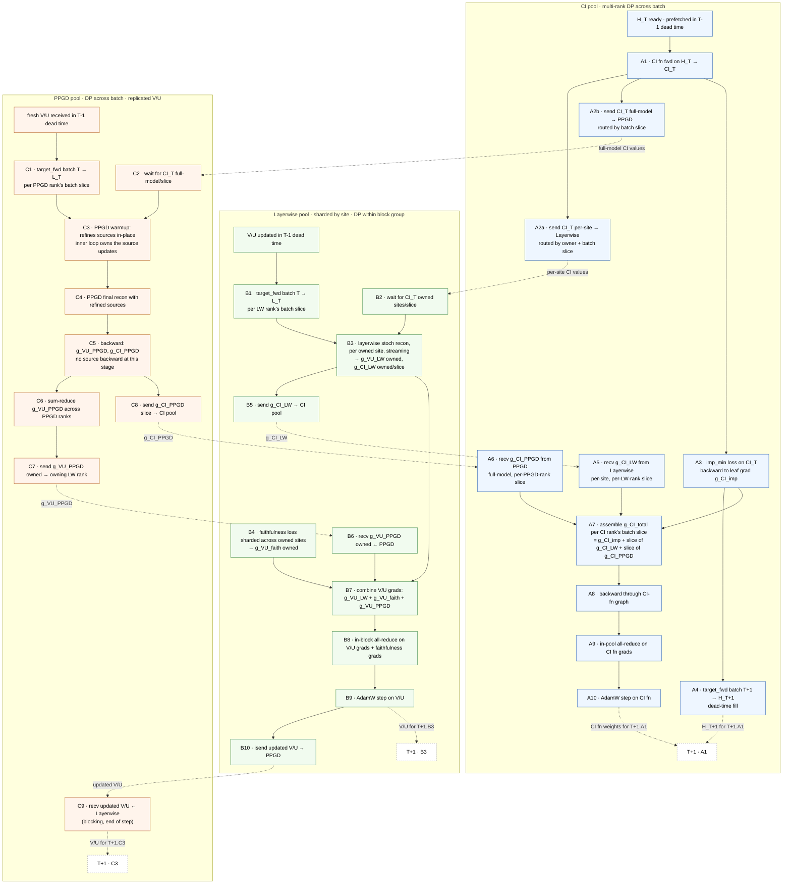
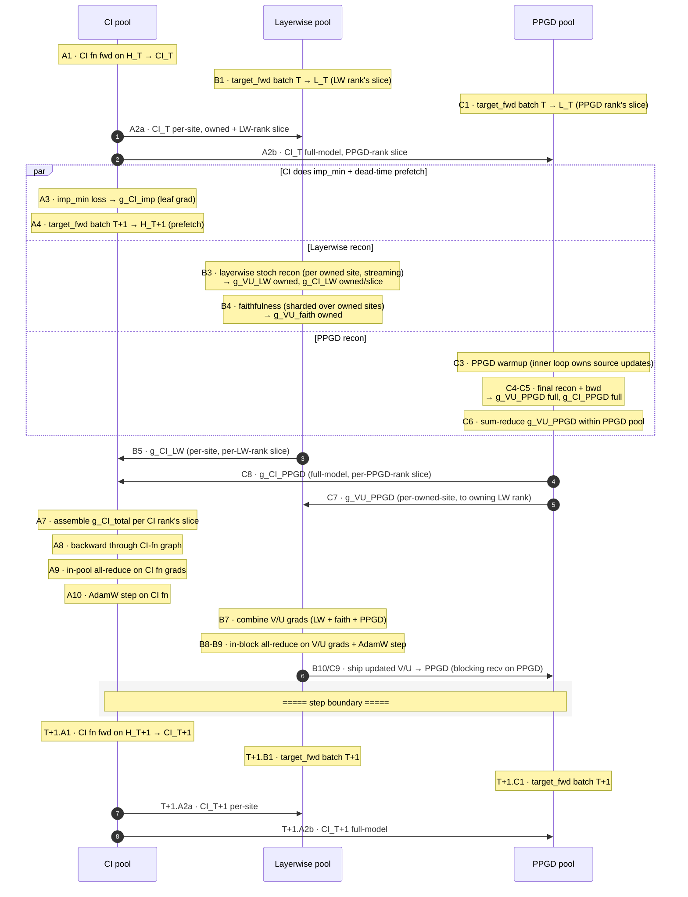

# Three-pool training — design sketch

Splits training across three heterogeneous GPU pools — CI, LW (layerwise V/U),
and PPGD — so a **global shared transformer** CI fn is physically realizable: a
dedicated, replicated CI pool can host a CI fn that spans all sites, while V/U
sites are sharded across the LW pool.

## Pool roles

| Pool       | Owns                            | Sharded? | Notes |
|------------|---------------------------------|----------|-------|
| **CI**     | CI fn + CI-fn optimizer state   | DP across batch (replicated CI fn) | Computes canonical CI values + importance-minimality. Multi-rank DP, same pattern as today's PPGD pool. |
| **Layerwise** | V/U + V/U optimizer state    | by site (block groups) + DP across batch within a group | Layerwise stoch recon + faithfulness. Same shape as today's Pool A minus the CI fn. |
| **PPGD**   | full V/U replica + PPGD sources | DP across batch (replicated V/U)   | Full-model PPGD. Same as today's Pool B. Inner-loop warmup owns source updates; final recon backward only seeds V/U + CI grads. |

## Code structure (typed-DAG layering)

The subsystem is layered so the SPMD program reads like its dependency DAG and
invalid states / operations / orderings are type-errors rather than runtime
asserts:

| File | What it owns |
|---|---|
| `layout.py` | `World` — declarative topology + every process group + all batch-split routing math. Identical on every rank. No per-rank fields. |
| `role.py` | `PoolRole = CIRole \| LWRole \| PPGDRole` — this rank's view. Each variant carries ONLY the fields valid for its pool (no `\| None` bag). Replaces the old `ThreePoolLayout` optional-attr bag + `assert self.my_pool == ...` guards. |
| `portals.py` | One typed object per cross-pool DAG edge. Each defines its payload, routing, pack/unpack, process group, and reduction/placement ONCE; sender + receiver are two methods on the SAME class, so they can't drift. Also the three in-pool collectives. Per-pool bundles (`CIPortals` / `LWPortals` / `PPGDPortals`) expose only the edges that pool participates in. |
| `context.py` | `PoolContext = CIContext \| LWContext \| PPGDContext` — bundles `world` + `role` + that pool's portal bundle. The trainer builds one and `match`es it; each step fn receives its specific context type. |
| `step_{ci,layerwise,ppgd}.py` | The per-pool step bodies. Take their specific `*Context`, drive their portals. |
| `optimize.py` | `ThreePoolTrainer` — wiring + per-step `match ctx:` dispatch. |
| `reductions.py`, `checkpoint.py`, `eval_step.py` | Cross-pool logging / checkpoint-gather / eval, dispatched by `match ctx:`. |

### The six cross-pool edges (one portal class each)

| Edge | Portal | Payload |
|---|---|---|
| CI → LW   | `CiValuesToLayerwise` | per-site CI values (owned sites, LW-rank batch sub-slice) |
| CI → PPGD | `CiValuesToPPGD`      | full-model CI values (PPGD-rank batch sub-slice) |
| LW → CI   | `GradCiFromLayerwise` | per-owned-site CI grads (per-LW-rank slice, stitched on CI side) |
| PPGD → CI | `GradCiFromPPGD`      | full-model CI grads (per-PPGD-rank slice, stitched on CI side) |
| PPGD → LW | `GradVuFromPPGD`      | per-owned-site V/U grads (after PPGD in-pool sum-reduce) |
| LW → PPGD | `UpdatedVuToPPGD`     | updated V/U (leader-rooted broadcast over {leader} ∪ PPGD) |

Eval adds `CiOutputsEvalToPPGD` (CI → PPGD, full `CIOutputs`).

### What became unrepresentable

* **Wrong-pool comm.** An LW step holds only `LWPortals`; it has no handle to
  the CI pool's `GradCiFromPPGD.recv` or to `UpdatedVuToPPGD.post_recv`. The
  old `assert self.my_pool == "..."` at the top of each comm method is gone —
  the call simply doesn't typecheck.
* **Reading a field that doesn't exist for this pool.** `CIRole` has no
  `owned_sites`; `LWRole` has no `slice_idx`. The old
  `my_ci_slice_idx: int \| None` + `assert ... is not None` pattern (which
  could only fail at runtime) is now a type error.
* **Send/recv pack-layout drift.** Each edge's pack/unpack lives in one class,
  so a change to the wire layout updates both halves at once.

## Per-step dependency graph (steady state, step T)

Each pool's column reads top-to-bottom in time. Solid arrows are within-step
deps; dashed arrows are cross-step.

## Synchronized timeline (one step T, all three pools share a vertical axis)

`sequenceDiagram` gives every actor the same vertical time axis, so you can
read across rows to see what each pool is doing at the same moment. Cross-pool
arrows are the actual sends. `Note over` annotations cover work that happens
inside a pool without messaging.

The `par` block is where the visible sync shines: all three pools fire in
parallel and you can see at-a-glance that the recon pools' heavy lifting
(B3-B4, C3-C5) happens concurrently with CI's dead-time prefetch (A3-A4).
The V/U opt step + ship-back (B8-B10 / C9) run synchronously at the end of
step T, before the boundary.

## Strict cross-step edges

Only three edges actually force a wait between steps:

| Edge | Hidden behind |
|---|---|
| `T+1.A1` (CI fn fwd) needs `T.A10` (CI fn AdamW) | — (CI fn fwd kicks off T+1) |
| `T+1.A1` (CI fn fwd) needs `T.A4` (`H_{T+1}` prefetch) | T's recon window |
| `T+1.C3` (PPGD warmup) needs `T.B10` (V/U ship) → `T.C9` recv | resolved within step T |

Everything else fits inside step T.

## Routing complexity

The defining wrinkle is **3-way batch slicing**:

- CI rank `i` produces CI values for batch slice `S_ci[i]` and all sites.
- Layerwise rank `j` needs CI values for its owned sites `O[j]` and batch slice `S_lw[j]`.
- PPGD rank `k` needs CI values for all sites and batch slice `S_pgd[k]`.

In general `S_ci[i]`, `S_lw[j]`, `S_pgd[k]` don't align — so the CI→LW and
CI→PPGD sends become **many-to-many along the batch dim**. Symmetric for grads
coming back. A reasonable simplification for the MVP is to constrain the
batch splits so each LW slice and each PPGD slice fits inside exactly one CI
slice (i.e. choose `N_ci` to divide both `N_lw` and `N_pgd`, or vice versa),
which reduces it to one-to-many fan-out + many-to-one reduction.

## Open design questions to resolve before coding

1. **Batch-split divisibility.** Pick an N_ci / N_lw / N_pgd compatibility
   rule. Easiest: `N_ci` divides `N_pgd` and `N_lw_per_block`. Validator should
   reject anything else loudly.
2. **CI value wire dtype.** Today CI is shipped bf16 and upcast to fp32 on the
   Layerwise side. Same pattern likely works for both downstream pools.
3. **Where do imp_min grads enter the CI-fn backward?** Cleanest is: imp_min
   is computed inside the CI-fn forward graph and contributes directly to the
   single CI-fn backward, with `g_CI_LW + g_CI_PPGD` injected as a `grad_tensors=`
   seed on the same backward call (same shape as today's pool-A combined backward).
4. **Validator extensions.** Require `ImportanceMinimalityLoss` lives on CI
   pool; allow `mode: layerwise`
   *or* `mode: global` (with `fn_type: global_shared_transformer`) since CI
   ownership is no longer sharded.
5. **Checkpointing.** Still no distributed-aware checkpoint, so `save_every`
   stays None for the MVP.

---

# Remaining lack-of-dependency to exploit

A scan of the above for places where Python blocks on something that could
have been kicked off earlier (or where two blocking ops could be merged).
Listed roughly by leverage.

### 1. **LW: post async recv_g_vu early, wait at combine**

`recv_g_vu_from_ppgd` is currently sync at D5. It only blocks because we
haven't posted the irecv. The data dep (`combine` at D6) only needs the
grads at D6 — so we can post the irecv right after the target_fwd kicks off
(A2), letting the recv overlap with everything in B + C + D1-D4. Wait at D5.

Implementation cost: add async variant in layout.py
(`async_recv_g_vu_from_ppgd_kickoff` + `wait_and_unpack_g_vu`), thread the
state through D5 in step_layerwise. Modest (~50 LOC).

Expected win: hides recv latency (probably significant if PPGD is the slow
pool — its g_VU send happens after PPGD's full warmup + recon + sum-reduce,
which is the bulk of PPGD's step). Could shave ~30-100 ms per step.

### 2. **CI: post async recvs of g_CI from BOTH downstream pools concurrently**

Currently `recv_g_ci_from_layerwise` and `recv_g_ci_from_ppgd` are two
separate sync calls (each itself pipelined internally). Could refactor to
post both pools' irecvs in one call, then wait on all together. The
imp_min + prefetch H_T+1 work happens between A2 and A5 — moving the recv
posts to right after A2 (the sends) lets them race with imp_min compute on
the GPU.

Implementation cost: similar to (1), ~30 LOC.

Expected win: hides the recv setup latency. The actual blocking time of
recv is dominated by waiting for LW/PPGD to send their grads; this
refactor doesn't change that, just removes the per-call NCCL setup overhead.
Small but real (~5-10 ms).

### 3. **CI: async in-pool all_reduce on CI fn grads (mirror the LW pattern)**

CI's in-pool all_reduce (A9) is currently sync. Same trick as LW: kick off
async at end of iter T, wait at start of iter T+1 — overlapped with CI's
next iter's target_fwd / CI fn fwd kernels.

Implementation cost: pattern-match what we just did for LW. ~80 LOC.

Expected win: hides the CI in-pool all_reduce latency. For `N_ci > 1`
(currently `N_ci=1` in the example, so no-op). When multi-rank CI is used,
this is a real win — maybe ~10-30 ms / step.

### 4. **PPGD: async send_g_vu + send_g_ci can be kicked off in parallel**

Today (D7, D8) are sequential `dist.isend + wait` blocks. Combining them so
both pools' sends share one wait at end of phase D removes a serialization.

Implementation cost: ~20 LOC.

Expected win: small (~5 ms) — both sends are short.

### 5. **LW: send_g_ci + recv_g_vu overlap**

D4 (send g_CI to CI) and D5 (recv g_VU from PPGD) currently sequential.
They're independent ops — could post both async then wait on both.

Implementation cost: ~20 LOC.

Expected win: small (~5-10 ms), as both are short NCCL ops.

---

The pattern that emerges: **most Python-blocking points in the per-step flow
are NCCL ops, and most can be converted to `async_op=True` kickoff + later
wait with a fixed structural change (split layout method into kickoff +
wait_and_unpack).** The only blocking points that can't be elided this way
are the ones where the data dep is genuinely "I need this immediately to
proceed" — and the obvious example is the `Work.wait()` on recv_ci right
before zero_grad + faith_bwd on LW (we need fresh V/U... wait no, faith
doesn't need CI; only layerwise needs CI). Actually that wait could be
deferred further too — faith bwd could happen before wait_ci, and only
layerwise streaming needs CI. Push wait_ci into D3 (right before layerwise).
Small additional overlap.

Next session, if profile data backs up these projections, the biggest wins
look like:

- **(1) async recv_g_vu** — moderate effort, likely significant savings
- **(3) async CI in-pool all_reduce** — only if multi-rank CI

Defer the rest until profile data shows them on the critical path.
